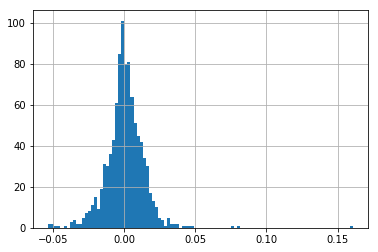

In this project, we observe distributions of a read world data. The data comprises of Stock prices of "Google" from year 2014-2018. We will compare normal and t-distributions to fit the observed values. Finally, we will try Mixture of Gaussians to fit the data and note scope and limitations. 


```python
import pandas as pd
import numpy as np
import matplotlib.pyplot as plt
%matplotlib inline
```


```python
data = pd.read_csv('stock_prices.csv', parse_dates=True)
```


```python
goog = data[data['Name'] == 'GOOG'].copy()
goog.head()
```


<div>
<style scoped>
    .dataframe tbody tr th:only-of-type {
        vertical-align: middle;
    }

    .dataframe tbody tr th {
        vertical-align: top;
    }

    .dataframe thead th {
        text-align: right;
    }
</style>
<table border="1" class="dataframe">
  <thead>
    <tr style="text-align: right;">
      <th></th>
      <th>date</th>
      <th>open</th>
      <th>high</th>
      <th>low</th>
      <th>close</th>
      <th>volume</th>
      <th>Name</th>
    </tr>
  </thead>
  <tbody>
    <tr>
      <th>251567</th>
      <td>2014-03-27</td>
      <td>568.000</td>
      <td>568.00</td>
      <td>552.92</td>
      <td>558.46</td>
      <td>13052</td>
      <td>GOOG</td>
    </tr>
    <tr>
      <th>251568</th>
      <td>2014-03-28</td>
      <td>561.200</td>
      <td>566.43</td>
      <td>558.67</td>
      <td>559.99</td>
      <td>41003</td>
      <td>GOOG</td>
    </tr>
    <tr>
      <th>251569</th>
      <td>2014-03-31</td>
      <td>566.890</td>
      <td>567.00</td>
      <td>556.93</td>
      <td>556.97</td>
      <td>10772</td>
      <td>GOOG</td>
    </tr>
    <tr>
      <th>251570</th>
      <td>2014-04-01</td>
      <td>558.710</td>
      <td>568.45</td>
      <td>558.71</td>
      <td>567.16</td>
      <td>7932</td>
      <td>GOOG</td>
    </tr>
    <tr>
      <th>251571</th>
      <td>2014-04-02</td>
      <td>565.106</td>
      <td>604.83</td>
      <td>562.19</td>
      <td>567.00</td>
      <td>146697</td>
      <td>GOOG</td>
    </tr>
  </tbody>
</table>
</div>


```python
goog.set_index('date')['close'].plot()
```


    <matplotlib.axes._subplots.AxesSubplot at 0x7fc579892b70>


Since returns are normalized to 0-1, we will be working with returns instead of prices


```python
goog['prev_close'] = goog['close'].shift(1)
goog['return'] = goog['close'] / goog['prev_close'] - 1
goog['return'].hist(bins=100);
```





```python
goog['return'].mean()
```


    0.000744587445980615


```python
goog['return'].std()
```


    0.014068710504926713


### Normal Distribution


```python
from scipy.stats import norm
```


```python
x_list = np.linspace(goog['return'].min(),goog['return'].max(),100)
y_list = norm.pdf(x_list, loc=goog['return'].mean(), scale=goog['return'].std())
```


```python
plt.plot(x_list, y_list);
goog['return'].hist(bins=100, density=True);
```


We note that the distribution doesnot quite fit the gaussian distribution due to higher kurtosis.

### t-Distribution


```python
from scipy.stats import t as tdist
```


```python
params = tdist.fit(goog['return'].dropna())
```


```python
params
```


    (3.4870263950708473, 0.000824161133877212, 0.009156583689241837)


```python
df, loc, scale = params
```


```python
y_list = tdist.pdf(x_list, df, loc, scale)
```


```python
plt.plot(x_list, y_list);
goog['return'].hist(bins=100, density=True);
```


The t-distribution fits the data quite well. However we have one more param that we deal with.

### Mixture of Gaussians


```python
from sklearn.mixture import GaussianMixture

data = np.array(goog['return'].dropna()).reshape(-1, 1)
model = GaussianMixture(n_components=2)
model.fit(data)

weights = model.weights_
means = model.means_
cov = model.covariances_
print("weights:", weights)
print("means:", means)
print("variances:", cov)
```

    weights: [0.29533565 0.70466435]
    means: [[-0.00027777]
     [ 0.00117307]]
    variances: [[[5.05105403e-04]]
    
     [[6.96951828e-05]]]


```python
means = means.flatten()
var = cov.flatten()
```


```python
x_list = np.linspace(data.min(), data.max(), 100)
fx0 = norm.pdf(x_list, means[0], np.sqrt(var[0]))
fx1 = norm.pdf(x_list, means[1], np.sqrt(var[1]))
fx = weights[0] * fx0 + weights[1] * fx1
```


```python
goog['return'].hist(bins=100, density=True)
plt.plot(x_list, fx, label='mixture model')
plt.legend();
```


We note the performance of GMM with n_components=2. The fit is similar to the t-distibution. The number of params is still 3 since GMM with n_component=2 has 2*DOF-1 where DOF is the degree of freedom of each gaussian.

We note that GMMs are universal approximatiors. Hence, we can better fit the distribution with more gaussian in the mixture. We try it with 10 components.


```python
num_components = 10
model = GaussianMixture(n_components=num_components)
model.fit(data)

weights = model.weights_
means = model.means_
cov = model.covariances_

means = means.flatten()
var = cov.flatten()

fx = 0
x_list = np.linspace(data.min(), data.max(), 100)
for i in range(num_components):
    fx += weights[i] * norm.pdf(x_list, means[i], np.sqrt(var[i]))

```


```python
goog['return'].hist(bins=100, density=True)
plt.plot(x_list, fx, label='mixture model')
plt.legend();
```


We note the fit is much better with n_components = 10. However, this comes at the cost of 16 additional params. Also, we're in the range of overfitting the data. Finally, there doesnt seem to exist simple Hypothesis testing routine for mixture of gaussians. The best I've seen are Bayes factor methods on the posterior distribution. I plan to discuss Bayesian methods for hypothesis testing on my next project.  
