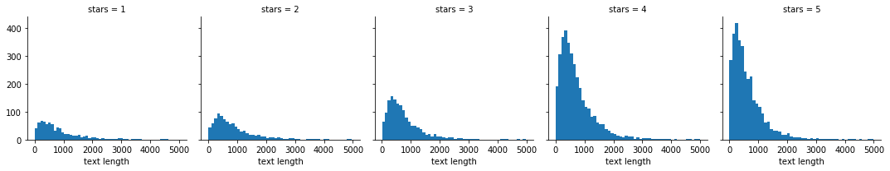
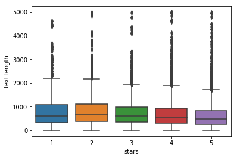
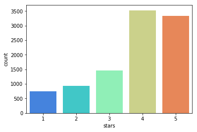
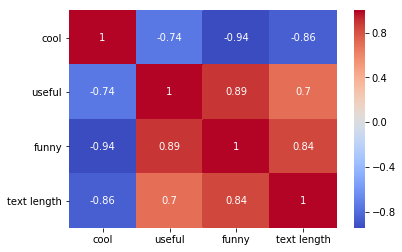

## Data: [Yelp Review Data Set from Kaggle](https://www.kaggle.com/c/yelp-recsys-2013).

** Data Head **

<table border="1" class="dataframe">
  <thead>
    <tr style="text-align: right;">
      <th></th>
      <th>business_id</th>
      <th>date</th>
      <th>review_id</th>
      <th>stars</th>
      <th>text</th>
      <th>type</th>
      <th>user_id</th>
      <th>cool</th>
      <th>useful</th>
      <th>funny</th>
    </tr>
  </thead>
  <tbody>
    <tr>
      <th>0</th>
      <td>9yKzy9PApeiPPOUJEtnvkg</td>
      <td>2011-01-26</td>
      <td>fWKvX83p0-ka4JS3dc6E5A</td>
      <td>5</td>
      <td>My wife took me here on my birthday for breakf...</td>
      <td>review</td>
      <td>rLtl8ZkDX5vH5nAx9C3q5Q</td>
      <td>2</td>
      <td>5</td>
      <td>0</td>
    </tr>
    <tr>
      <th>1</th>
      <td>ZRJwVLyzEJq1VAihDhYiow</td>
      <td>2011-07-27</td>
      <td>IjZ33sJrzXqU-0X6U8NwyA</td>
      <td>5</td>
      <td>I have no idea why some people give bad review...</td>
      <td>review</td>
      <td>0a2KyEL0d3Yb1V6aivbIuQ</td>
      <td>0</td>
      <td>0</td>
      <td>0</td>
    </tr>
    <tr>
      <th>2</th>
      <td>6oRAC4uyJCsJl1X0WZpVSA</td>
      <td>2012-06-14</td>
      <td>IESLBzqUCLdSzSqm0eCSxQ</td>
      <td>4</td>
      <td>love the gyro plate. Rice is so good and I als...</td>
      <td>review</td>
      <td>0hT2KtfLiobPvh6cDC8JQg</td>
      <td>0</td>
      <td>1</td>
      <td>0</td>
    </tr>
    <tr>
      <th>3</th>
      <td>_1QQZuf4zZOyFCvXc0o6Vg</td>
      <td>2010-05-27</td>
      <td>G-WvGaISbqqaMHlNnByodA</td>
      <td>5</td>
      <td>Rosie, Dakota, and I LOVE Chaparral Dog Park!!...</td>
      <td>review</td>
      <td>uZetl9T0NcROGOyFfughhg</td>
      <td>1</td>
      <td>2</td>
      <td>0</td>
    </tr>
    <tr>
      <th>4</th>
      <td>6ozycU1RpktNG2-1BroVtw</td>
      <td>2012-01-05</td>
      <td>1uJFq2r5QfJG_6ExMRCaGw</td>
      <td>5</td>
      <td>General Manager Scott Petello is a good egg!!!...</td>
      <td>review</td>
      <td>vYmM4KTsC8ZfQBg-j5MWkw</td>
      <td>0</td>
      <td>0</td>
      <td>0</td>
    </tr>
  </tbody>
</table>

** Crude Data Metrics **

    <class 'pandas.core.frame.DataFrame'>
    RangeIndex: 10000 entries, 0 to 9999
    Data columns (total 10 columns):
    business_id    10000 non-null object
    date           10000 non-null object
    review_id      10000 non-null object
    stars          10000 non-null int64
    text           10000 non-null object
    type           10000 non-null object
    user_id        10000 non-null object
    cool           10000 non-null int64
    useful         10000 non-null int64
    funny          10000 non-null int64
    dtypes: int64(4), object(6)
    memory usage: 781.3+ KB

<table border="1" class="dataframe">
  <thead>
    <tr style="text-align: right;">
      <th></th>
      <th>stars</th>
      <th>cool</th>
      <th>useful</th>
      <th>funny</th>
    </tr>
  </thead>
  <tbody>
    <tr>
      <th>count</th>
      <td>10000.000000</td>
      <td>10000.000000</td>
      <td>10000.000000</td>
      <td>10000.000000</td>
    </tr>
    <tr>
      <th>mean</th>
      <td>3.777500</td>
      <td>0.876800</td>
      <td>1.409300</td>
      <td>0.701300</td>
    </tr>
    <tr>
      <th>std</th>
      <td>1.214636</td>
      <td>2.067861</td>
      <td>2.336647</td>
      <td>1.907942</td>
    </tr>
    <tr>
      <th>min</th>
      <td>1.000000</td>
      <td>0.000000</td>
      <td>0.000000</td>
      <td>0.000000</td>
    </tr>
    <tr>
      <th>25%</th>
      <td>3.000000</td>
      <td>0.000000</td>
      <td>0.000000</td>
      <td>0.000000</td>
    </tr>
    <tr>
      <th>50%</th>
      <td>4.000000</td>
      <td>0.000000</td>
      <td>1.000000</td>
      <td>0.000000</td>
    </tr>
    <tr>
      <th>75%</th>
      <td>5.000000</td>
      <td>1.000000</td>
      <td>2.000000</td>
      <td>1.000000</td>
    </tr>
    <tr>
      <th>max</th>
      <td>5.000000</td>
      <td>77.000000</td>
      <td>76.000000</td>
      <td>57.000000</td>
    </tr>
  </tbody>
</table>

** Data Exploration **

**FacetGrid from the seaborn library to create a grid of 5 histograms of text length based off of the star ratings.**

    <seaborn.axisgrid.FacetGrid at 0x7facdee80410>

**Boxplot of text length for each star category.**

    <matplotlib.axes._subplots.AxesSubplot at 0x7facde8a7210>

**Countplot of the number of occurrences for each type of star rating.**

    <matplotlib.axes._subplots.AxesSubplot at 0x7fad1c8eded0>

** Group by the mean values of the numerical columns **

<table border="1" class="dataframe">
  <thead>
    <tr style="text-align: right;">
      <th></th>
      <th>cool</th>
      <th>useful</th>
      <th>funny</th>
      <th>text length</th>
    </tr>
    <tr>
      <th>stars</th>
      <th></th>
      <th></th>
      <th></th>
      <th></th>
    </tr>
  </thead>
  <tbody>
    <tr>
      <th>1</th>
      <td>0.576769</td>
      <td>1.604806</td>
      <td>1.056075</td>
      <td>826.524700</td>
    </tr>
    <tr>
      <th>2</th>
      <td>0.719525</td>
      <td>1.563107</td>
      <td>0.875944</td>
      <td>842.265372</td>
    </tr>
    <tr>
      <th>3</th>
      <td>0.788501</td>
      <td>1.306639</td>
      <td>0.694730</td>
      <td>758.505133</td>
    </tr>
    <tr>
      <th>4</th>
      <td>0.954623</td>
      <td>1.395916</td>
      <td>0.670448</td>
      <td>712.944129</td>
    </tr>
    <tr>
      <th>5</th>
      <td>0.944261</td>
      <td>1.381780</td>
      <td>0.608631</td>
      <td>625.015583</td>
    </tr>
  </tbody>
</table>

**Correlations in the grouped dataframe:**

<table border="1" class="dataframe">
  <thead>
    <tr style="text-align: right;">
      <th></th>
      <th>cool</th>
      <th>useful</th>
      <th>funny</th>
      <th>text length</th>
    </tr>
  </thead>
  <tbody>
    <tr>
      <th>cool</th>
      <td>1.000000</td>
      <td>-0.743329</td>
      <td>-0.944939</td>
      <td>-0.857651</td>
    </tr>
    <tr>
      <th>useful</th>
      <td>-0.743329</td>
      <td>1.000000</td>
      <td>0.894506</td>
      <td>0.699895</td>
    </tr>
    <tr>
      <th>funny</th>
      <td>-0.944939</td>
      <td>0.894506</td>
      <td>1.000000</td>
      <td>0.843463</td>
    </tr>
    <tr>
      <th>text length</th>
      <td>-0.857651</td>
      <td>0.699895</td>
      <td>0.843463</td>
      <td>1.000000</td>
    </tr>
  </tbody>
</table>

**Visualizing correlations as heatmap **

    <matplotlib.axes._subplots.AxesSubplot at 0x7fad1c77e8d0>

## NLP Classification

**For this project, We create dataframe called yelp_class that contains the columns of yelp dataframe but for only the 1 or 5 star reviews. We create two objects X and y. X will be the 'text' column of yelp_class and y will be the 'stars' column of yelp_class.Use the count verctorizer to vectorize X. We start with using simple Multinomial Naive bayes classifier on this X,y dataset**

## Model Evaluations

** Confusion matrix and classification report using MNB**

    [[156  77]
     [ 37 956]]
    
    
                 precision    recall  f1-score   support
    
              1       0.81      0.67      0.73       233
              5       0.93      0.96      0.94       993
    
    avg / total       0.90      0.91      0.90      1226
    

**Really not bad. Now we use, TF-IDF weighing scheme on X and utilize Sckikit learn Pipeline method and evaluate on Multinomial Naive Bayes and Random Forest models**

### Model Evaluations

** Classification report and confusion matrix (Multinomial Naive Bayes):**

[[  1 232]
 [  0 993]]

             precision    recall  f1-score   support

          1       1.00      0.00      0.01       233
	            5       0.81      1.00      0.90       993

avg / total       0.85      0.81      0.73      1226

** Classification report and confusion matrix (Random Forest):**

    [[ 30 203]
     [  1 992]]
    
    
                 precision    recall  f1-score   support
    
              1       0.97      0.13      0.23       233
              5       0.83      1.00      0.91       993
    
    avg / total       0.86      0.83      0.78      1226
    

#TF-IDF with MNB prefromed worse. RF imporved recall for class 1. For this project, the model without TF-IDF weighing performed better.