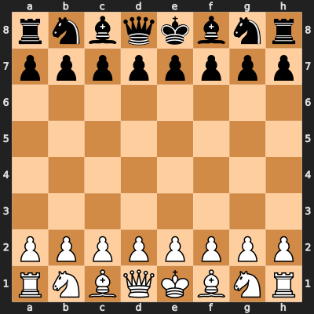
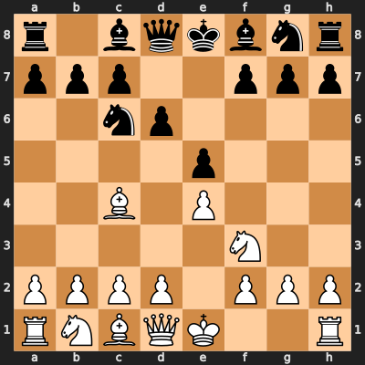
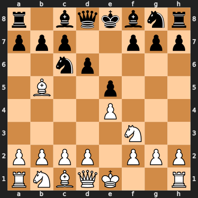
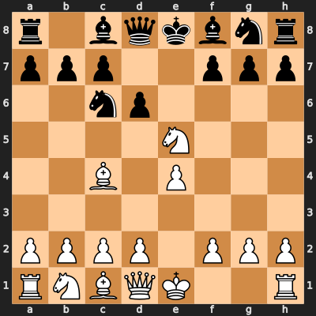

This project expands on my previous research into minimax algorithm with a Expectimax version. The results are fascinating. Min-Max, assuming a perfect opponent, often chose a solid, safe move. It prepared for the worst-case scenario. Expectimax, on the other hand, assumes a random opponent. It calculates the *average* outcome over all of the opponent's possible moves. This lead it to choose a riskier, more aggressive move that has a very high payoff if the opponent doesn't find the single best reply. In our test cases, we observed this difference in strategy. Min-Max is shown to be a pessimist; Expectimax on the other hand, a statistical realist (or an optimist, depending on the position).


```python
import chess
import chess.svg
import time
from IPython.display import display, SVG
```

Let's visualize our initial state.


```python
board = chess.Board()
display(SVG(chess.svg.board(board=board, size=400)))
```


    

    


##Use the same functions from previous experiment


```python
# Piece values
piece_values = {
    chess.PAWN: 100, chess.KNIGHT: 320, chess.BISHOP: 330,
    chess.ROOK: 500, chess.QUEEN: 900, chess.KING: 20000
}

# Piece-Square Tables (from a simplified perspective)
# These tables are mirrored for black pieces.
pawn_pst = [
    0,  0,  0,  0,  0,  0,  0,  0,
    50, 50, 50, 50, 50, 50, 50, 50,
    10, 10, 20, 30, 30, 20, 10, 10,
    5,  5, 10, 25, 25, 10,  5,  5,
    0,  0,  0, 20, 20,  0,  0,  0,
    5, -5,-10,  0,  0,-10, -5,  5,
    5, 10, 10,-20,-20, 10, 10,  5,
    0,  0,  0,  0,  0,  0,  0,  0
]

knight_pst = [
    -50,-40,-30,-30,-30,-30,-40,-50,
    -40,-20,  0,  0,  0,  0,-20,-40,
    -30,  0, 10, 15, 15, 10,  0,-30,
    -30,  5, 15, 20, 20, 15,  5,-30,
    -30,  0, 15, 20, 20, 15,  0,-30,
    -30,  5, 10, 15, 15, 10,  5,-30,
    -40,-20,  0,  5,  5,  0,-20,-40,
    -50,-40,-30,-30,-30,-30,-40,-50,
]

bishop_pst = [
    -20,-10,-10,-10,-10,-10,-10,-20,
    -10,  0,  0,  0,  0,  0,  0,-10,
    -10,  0,  5, 10, 10,  5,  0,-10,
    -10,  5,  5, 10, 10,  5,  5,-10,
    -10,  0, 10, 10, 10, 10,  0,-10,
    -10, 10, 10, 10, 10, 10, 10,-10,
    -10,  5,  0,  0,  0,  0,  5,-10,
    -20,-10,-10,-10,-10,-10,-10,-20,
]

rook_pst = [
    0,  0,  0,  0,  0,  0,  0,  0,
    5, 10, 10, 10, 10, 10, 10,  5,
    -5,  0,  0,  0,  0,  0,  0, -5,
    -5,  0,  0,  0,  0,  0,  0, -5,
    -5,  0,  0,  0,  0,  0,  0, -5,
    -5,  0,  0,  0,  0,  0,  0, -5,
    -5,  0,  0,  0,  0,  0,  0, -5,
    0,  0,  0,  5,  5,  0,  0,  0
]

queen_pst = [
    -20,-10,-10, -5, -5,-10,-10,-20,
    -10,  0,  0,  0,  0,  0,  0,-10,
    -10,  0,  5,  5,  5,  5,  0,-10,
    -5,  0,  5,  5,  5,  5,  0, -5,
    0,  0,  5,  5,  5,  5,  0, -5,
    -10,  5,  5,  5,  5,  5,  0,-10,
    -10,  0,  5,  0,  0,  0,  0,-10,
    -20,-10,-10, -5, -5,-10,-10,-20
]

king_pst = [
    -30,-40,-40,-50,-50,-40,-40,-30,
    -30,-40,-40,-50,-50,-40,-40,-30,
    -30,-40,-40,-50,-50,-40,-40,-30,
    -30,-40,-40,-50,-50,-40,-40,-30,
    -20,-30,-30,-40,-40,-30,-30,-20,
    -10,-20,-20,-20,-20,-20,-20,-10,
    20, 20,  0,  0,  0,  0, 20, 20,
    20, 30, 10,  0,  0, 10, 30, 20
]

piece_psts = {
    chess.PAWN: pawn_pst, chess.KNIGHT: knight_pst, chess.BISHOP: bishop_pst,
    chess.ROOK: rook_pst, chess.QUEEN: queen_pst, chess.KING: king_pst
}

def evaluate_board(board):
    """
    Evaluates the board state and returns a score.
    Positive score is good for White, negative is good for Black.
    """
    if board.is_checkmate():
        if board.turn == chess.WHITE: return -float('inf') # Black wins
        else: return float('inf') # White wins
    if board.is_stalemate() or board.is_insufficient_material() or board.is_seventyfive_moves() or board.is_fivefold_repetition():
        return 0

    score = 0
    for square in chess.SQUARES:
        piece = board.piece_at(square)
        if piece is not None:
            # Material value
            value = piece_values[piece.piece_type]
            # Positional value from PST
            pst = piece_psts[piece.piece_type]
            # The PST is from White's perspective, so we mirror it for Black
            pst_index = square if piece.color == chess.WHITE else chess.square_mirror(square)
            value += pst[pst_index]
            
            if piece.color == chess.WHITE:
                score += value
            else:
                score -= value
    return score
```

### The Expectimax Algorithm

While Min-Max is perfect for deterministic, two-player zero-sum games, many games involve an element of chance (e.g., dice rolls in backgammon). The **Expectimax** algorithm is an adaptation of Min-Max for such games.

It includes three types of nodes:
- **Maximizing Node (Us):** Same as in Min-Max, it chooses the action that maximizes its score.
- **Minimizing Node (Opponent):** In a true adversarial game, this is the same as Min-Max.
- **Chance Node:** This node calculates the *expected* value of its children. It averages the values of the possible outcomes, weighted by their probability of occurring.

Chess is a deterministic game, so it doesn't have true chance nodes. However, we can use the Expectimax framework to model an opponent who does not play optimally. Instead of assuming the opponent will always choose the move that is worst for us (the 'min' part of Min-Max), we can model an opponent who might play randomly. 

For this experiment, I will implement an Expectimax search where the **opponent's move is treated as a chance event**. We will assume the opponent chooses any of their legal moves with **equal probability**. This models a non-optimal, random opponent. My research question is: how does the best move change when we plan against a random opponent versus a perfect one..


```python
def expectimax(board, depth, maximizing_player):
    """Expectimax algorithm. Assumes the opponent plays a random legal move."""
    if depth == 0 or board.is_game_over():
        return evaluate_board(board), None

    best_move = None
    if maximizing_player:
        max_eval = -float('inf')
        for move in board.legal_moves:
            board.push(move)
            evaluation, _ = expectimax(board, depth - 1, False)
            board.pop()
            if evaluation > max_eval:
                max_eval = evaluation
                best_move = move
        return max_eval, best_move
    else: # Chance player (opponent)
        expected_eval = 0
        legal_moves = list(board.legal_moves)
        if not legal_moves:
            return evaluate_board(board), None
        
        for move in legal_moves:
            board.push(move)
            evaluation, _ = expectimax(board, depth - 1, True)
            board.pop()
            # Each move has equal probability
            expected_eval += evaluation
        return expected_eval / len(legal_moves), None
```


```python
def minimax(board, depth, alpha, beta, maximizing_player):
    """Min-Max algorithm with Alpha-Beta Pruning."""
    if depth == 0 or board.is_game_over():
        return evaluate_board(board), None

    best_move = None
    if maximizing_player:
        max_eval = -float('inf')
        for move in board.legal_moves:
            board.push(move)
            evaluation, _ = minimax(board, depth - 1, alpha, beta, False)
            board.pop()
            if evaluation > max_eval:
                max_eval = evaluation
                best_move = move
            alpha = max(alpha, evaluation)
            if beta <= alpha:
                break # Prune
        return max_eval, best_move
    else: # Minimizing player
        min_eval = float('inf')
        for move in board.legal_moves:
            board.push(move)
            evaluation, _ = minimax(board, depth - 1, alpha, beta, True)
            board.pop()
            if evaluation < min_eval:
                min_eval = evaluation
                best_move = move
            beta = min(beta, evaluation)
            if beta <= alpha:
                break # Prune
        return min_eval, best_move

def find_best_move(board, depth):
    """Helper function to initiate the search."""
    start_time = time.time()
    maximizing_player = (board.turn == chess.WHITE)
    score, best_move = minimax(board, depth, -float('inf'), float('inf'), maximizing_player)
    end_time = time.time()
    print(f"Search completed in {end_time - start_time:.4f} seconds.")
    print(f"Best move found: {best_move}")
    print(f"Evaluation score: {score}")
    return best_move
```

## Experiment and Analysis

Let's test our AI. We will set up a board position and ask our engine to find the best move for White. We will use a search depth of 3. A depth of 4 or 5 would be much stronger but would be too slow to run interactively in this notebook.

This is a simple tactical position. White has a potential attack. Let's see if our engine can find a good move.


```python
# A sample tactical position (FEN string)
fen = "r1bqkbnr/ppp2ppp/2np4/4p3/2B1P3/5N2/PPPP1PPP/RNBQK2R w KQkq - 0 4"
board = chess.Board(fen)

print("Board to analyze:")
display(SVG(chess.svg.board(board=board, size=400)))
```

    Board to analyze:


    

    


```python
# Find the best move for White with a depth of 3
print("--- Running Min-Max (Optimal Opponent) ---")
search_depth = 3
print(f"\n--- Finding best move for White (Depth: {search_depth}) ---")
best_move = find_best_move(board, search_depth)

# Make the move on the board and display the new state
minmax_board = board.copy()
if best_move:
    minmax_board.push(best_move)
    print("\nBoard after Min-Max AI's move:")
    display(SVG(chess.svg.board(board=minmax_board, size=400)))
```

    --- Running Min-Max (Optimal Opponent) ---
    
    --- Finding best move for White (Depth: 3) ---
    Search completed in 0.2760 seconds.
    Best move found: c4b5
    Evaluation score: 320
    
    Board after Min-Max AI's move:


    

    


```python
# Now, let's find the best move using Expectimax
print("\n\n--- Running Expectimax (Random Opponent) ---")
search_depth_em = 3
print(f"\n--- Finding best move for White (Depth: {search_depth_em}) ---")
# We need a separate find_best_move function for expectimax as it doesn't use alpha-beta
start_time = time.time()
score_em, best_move_em = expectimax(board, search_depth_em, True)
end_time = time.time()
print(f"Search completed in {end_time - start_time:.4f} seconds.")
print(f"Best move found: {best_move_em}")
print(f"Expected score: {score_em}")
if best_move:
    expectimax_board = board.copy()
    expectimax_board.push(best_move_em)
    print("\nBoard after Expectimax AI's move:")
    display(SVG(chess.svg.board(board=expectimax_board, size=400)))
```

    
    
    --- Running Expectimax (Random Opponent) ---
    
    --- Finding best move for White (Depth: 3) ---
    Search completed in 2.9109 seconds.
    Best move found: f3e5
    Expected score: inf
    
    Board after Expectimax AI's move:


    

    

