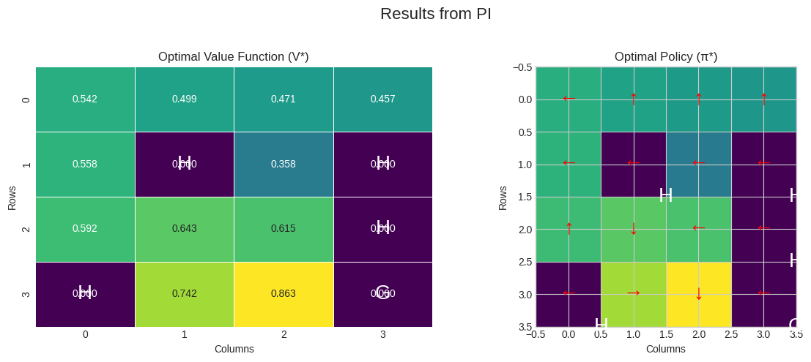

In [this project](https://github.com/mbastola/machine-learning-in-python/blob/master/Reinforcement-Learning/mdp/README.md), I delve into the fundamentals of Markov Decision Processes (MDPs) by analyzing and solving the `FrozenLake-v1` environment from the Gymnasium library. My goal is to understand the core components of an MDP and apply classic dynamic programming algorithms—Value Iteration and Policy Iteration—to find the optimal way to navigate this treacherous, slippery landscape.

The FrozenLake environment presents a scenario where an agent must travel from a starting state 'S' to a goal state 'G' across a grid of frozen and hole ('H') tiles. The challenge lies in the stochastic nature of the environment: the ice is slippery, so the agent's intended actions do not always result in the expected movement.


```python
import gym
import numpy as np
import matplotlib.pyplot as plt
import seaborn as sns

# Use a consistent style for plots
plt.style.use('seaborn-v0_8-whitegrid')
```


```python
# Initialize the environment
# is_slippery=True introduces stochasticity into the agent's movements.
env = gym.make('FrozenLake-v1', is_slippery=True, render_mode='rgb_array')

# We reset the environment to get the initial state
state, info = env.reset(seed=42) # Using a seed for reproducibility
```

## 1. Deconstructing the MDP
An MDP is formally defined by a tuple (S, A, P, R, γ). Let's examine each of these components within the context of our FrozenLake environment.

### Observation Space (S) - The States
The state space `S` represents all possible positions the agent can be in. In FrozenLake, this is a 4x4 grid, giving us 16 distinct states, indexed from 0 to 15.


```python
print("Observation Space (States):", env.observation_space)
n_states = env.observation_space.n
print("Number of States:", n_states)

# Let's render the environment to visualize the state space.
plt.figure(figsize=(6, 6))
plt.title("FrozenLake-v1 State Space")
plt.imshow(env.render())
plt.axis('off')
plt.show()
```

    Observation Space (States): Discrete(16)
    Number of States: 16


    

    


### Action Space (A) - The Agent's Moves
The action space `A` consists of all possible actions the agent can take. For this environment, there are four discrete actions.


```python
print("Action Space (Actions):", env.action_space)
n_actions = env.action_space.n
print("Number of Actions:", n_actions)

# Let's map these actions to human-readable format and symbols for visualization
action_names = {0: 'Left', 1: 'Down', 2: 'Right', 3: 'Up'}
action_symbols = {0: '←', 1: '↓', 2: '→', 3: '↑'}

print("\nAction Mapping:")
for key, val in action_names.items():
    print(f"  {key}: {val} ({action_symbols[key]})")
```

    Action Space (Actions): Discrete(4)
    Number of Actions: 4
    
    Action Mapping:
      0: Left (←)
      1: Down (↓)
      2: Right (→)
      3: Up (↑)


### Transition Probabilities (P) - The World's Dynamics
The transition probability function `P(s' | s, a)` defines the probability of transitioning to state `s'` from state `s` after taking action `a`. Due to the slippery ice, our chosen action is not guaranteed. The environment dynamics dictate that for any chosen action, there is a 1/3 probability of moving in the intended direction and a 1/3 probability of moving in either of the two perpendicular directions.

The `env.P` attribute provides this information. `P[state][action]` returns a list of tuples: `(probability, next_state, reward, terminated)`.


```python
env = env.unwrapped
```


```python
# Let's examine the transitions from state 0 (the start state) for action 1 (Down).
# Expected outcome: Move Down.
# Possible outcomes due to slipperiness: Move Left, Down, or Right.
print("Transitions from State 0 (Action: Down):")
print(env.P[0][1])

# We observe three possible outcomes, each with a probability of 0.333...
# This confirms the stochastic nature of the environment.
```

    Transitions from State 0 (Action: Down):
    [(0.3333333333333333, 0, 0.0, False), (0.3333333333333333, 4, 0.0, False), (0.3333333333333333, 1, 0.0, False)]


### Reward Function (R) - The Goal
The reward function `R(s, a, s')` specifies the reward received after transitioning from state `s` to `s'` by taking action `a`. In our case, the reward structure is sparse:
*   +1 for reaching the goal state 'G' (state 15).
*   0 for all other transitions, including falling into a hole 'H'.


```python
# Let's verify the reward for reaching the goal state (15).
# From state 14 (to the left of the goal), taking action 2 (Right) should lead to the goal.
print("Transitions from State 14 (Action: Right):")
print(env.P[14][2])

# As we can see, one of the possible transitions from state 14 when moving Right
# is to state 15, which yields a reward of 1.0 and terminates the episode.
```

    Transitions from State 14 (Action: Right):
    [(0.3333333333333333, 14, 0.0, False), (0.3333333333333333, 15, 1.0, True), (0.3333333333333333, 10, 0.0, False)]


## 2. Solving the MDP with Value Iteration
Value Iteration is a dynamic programming algorithm that finds the optimal value function `V*` by iteratively applying the Bellman optimality equation until convergence. The optimal value of a state is the maximum expected return achievable from that state.

The Bellman optimality equation is:
$$V_{k+1}(s) = \max_{a \in A} \sum_{s'} P(s'|s,a) [R(s,a,s') + \gamma V_k(s')]$$

Once we have the optimal value function `V*`, we can extract the optimal policy `π*` by choosing the action that maximizes the expected value from each state.


```python
def value_iteration(env, gamma=0.99, theta=1e-8):
    """
    Performs Value Iteration to find the optimal value function.
    """
    V = np.zeros(env.observation_space.n)
    
    while True:
        delta = 0
        # Iterate over all states
        for s in range(env.observation_space.n):
            v_old = V[s]
            
            # Calculate the Q-value for each action in the current state
            q_sa = np.zeros(env.action_space.n)
            for a in range(env.action_space.n):
                # Sum over all possible next states
                for prob, next_s, reward, _ in env.P[s][a]:
                    q_sa[a] += prob * (reward + gamma * V[next_s])
            
            # The new value for the state is the max Q-value
            V[s] = np.max(q_sa)
            
            # Check for convergence
            delta = max(delta, np.abs(v_old - V[s]))
            
        if delta < theta:
            break
            
    # Once V* is found, extract the optimal policy
    policy = np.zeros(env.observation_space.n, dtype=int)
    for s in range(env.observation_space.n):
        q_sa = np.zeros(env.action_space.n)
        for a in range(env.action_space.n):
            for prob, next_s, reward, _ in env.P[s][a]:
                q_sa[a] += prob * (reward + gamma * V[next_s])
        policy[s] = np.argmax(q_sa)
        
    return V, policy
```


```python
# Run the value iteration algorithm
optimal_V_vi, optimal_policy_vi = value_iteration(env)

print("Optimal Value Function (V*) from Value Iteration:\n", np.round(optimal_V_vi.reshape(4, 4), 3))
print("\nOptimal Policy (π*) from Value Iteration:\n", optimal_policy_vi.reshape(4, 4))
```

    Optimal Value Function (V*) from Value Iteration:
     [[0.542 0.499 0.471 0.457]
     [0.558 0.    0.358 0.   ]
     [0.592 0.643 0.615 0.   ]
     [0.    0.742 0.863 0.   ]]
    
    Optimal Policy (π*) from Value Iteration:
     [[0 3 3 3]
     [0 0 0 0]
     [3 1 0 0]
     [0 2 1 0]]


### Visual Analysis of Value Iteration Results
The raw numbers are useful, but visualizations provide a more intuitive understanding of the solution. We can plot the optimal value function `V*` as a heatmap to see which states are more "valuable" (i.e., have a higher probability of leading to the goal). We can also plot the optimal policy `π*` as a grid of arrows.


```python
def plot_results(V, policy, title):
    """Helper function to plot the value function and policy."""
    fig, ax = plt.subplots(1, 2, figsize=(12, 5))
    fig.suptitle(title, fontsize=16)
    
    # Plot the Value Function
    V_reshaped = V.reshape(4, 4)
    sns.heatmap(V_reshaped, annot=True, fmt=".3f", cmap="viridis", cbar=False, ax=ax[0], linewidths=.5)
    ax[0].set_title("Optimal Value Function (V*)")
    ax[0].set_xlabel("Columns")
    ax[0].set_ylabel("Rows")
    
    # Plot the Policy
    policy_reshaped = policy.reshape(4, 4)
    ax[1].imshow(V_reshaped, cmap="viridis") # Use value function for background color
    ax[1].set_title("Optimal Policy (π*)")
    ax[1].set_xlabel("Columns")
    ax[1].set_ylabel("Rows")
    
    # Add arrows for the policy
    for r in range(4):
        for c in range(4):
            action = policy_reshaped[r, c]
            arrow = action_symbols[action]
            ax[1].text(c, r, arrow, ha='center', va='center', color='red', fontsize=20)
            
    # Mark holes and goal for clarity
    desc = env.unwrapped.desc.astype(str)
    for r in range(4):
        for c in range(4):
            if desc[r, c] in 'HG':
                ax[0].text(c + 0.5, r + 0.5, desc[r, c], ha='center', va='center', color='white', fontsize=20)
                ax[1].text(c + 0.5, r + 0.5, desc[r, c], ha='center', va='center', color='white', fontsize=20)

    plt.tight_layout(rect=[0, 0, 1, 0.96])
    plt.show()

plot_results(optimal_V_vi, optimal_policy_vi, "Results from Value Iteration")
```


    

    


**Observations:**
*   The value function heatmap clearly shows that states closer to the goal 'G' (bottom-right) have higher values.
*   States surrounding holes 'H' have very low values, as expected.
*   The policy map provides a clear visual guide. For example, from the start state (0,0), the optimal action is to move Left. This seems counter-intuitive, but it's a strategy to avoid the hole at (1,1) by bumping against the wall.

## 3. Solving the MDP with Policy Iteration
Policy Iteration is another algorithm for finding the optimal policy. It alternates between two steps:
1.  **Policy Evaluation:** Given a policy `π`, calculate the value function `V^π` for that policy. This is done by solving the Bellman expectation equation until `V^π` converges.
    $$V_{k+1}^{\pi}(s) = \sum_{a} \pi(a|s) \sum_{s'} P(s'|s,a) [R(s,a,s') + \gamma V_k^{\pi}(s')]$$
    (For a deterministic policy, `π(a|s)` is 1 for the policy's action and 0 otherwise).
2.  **Policy Improvement:** Using the calculated `V^π`, improve the policy by choosing the action that maximizes the expected value for each state (acting greedily with respect to `V^π`).

These two steps are repeated until the policy no longer changes, at which point it has converged to the optimal policy `π*`.


```python
def policy_evaluation(env, policy, gamma=0.99, theta=1e-8):
    """
    Evaluates the value function for a given policy.
    """
    V = np.zeros(env.observation_space.n)
    while True:
        delta = 0
        for s in range(env.observation_space.n):
            v_old = V[s]
            v_new = 0
            # For a deterministic policy, we only consider the action given by the policy
            a = policy[s]
            for prob, next_s, reward, _ in env.P[s][a]:
                v_new += prob * (reward + gamma * V[next_s])
            V[s] = v_new
            delta = max(delta, abs(v_old - V[s]))
        if delta < theta:
            break
    return V

def policy_iteration(env, gamma=0.99):
    """
    Performs Policy Iteration to find the optimal policy and value function.
    """
    # Start with a random policy
    policy = np.random.randint(env.action_space.n, size=env.observation_space.n)
    
    while True:
        # Step 1: Policy Evaluation
        V = policy_evaluation(env, policy, gamma)
        
        # Step 2: Policy Improvement
        policy_stable = True
        for s in range(env.observation_space.n):
            old_action = policy[s]
            
            # Find the best action by looking one step ahead
            q_sa = np.zeros(env.action_space.n)
            for a in range(env.action_space.n):
                for prob, next_s, reward, _ in env.P[s][a]:
                    q_sa[a] += prob * (reward + gamma * V[next_s])
            
            best_action = np.argmax(q_sa)
            policy[s] = best_action
            
            # Check if the policy has changed
            if old_action != best_action:
                policy_stable = False
                
        if policy_stable:
            break
            
    # The final V is re-evaluated for the stable policy
    V = policy_evaluation(env, policy, gamma)
    return V, policy
```


```python
# Run policy iteration algorithm
optimal_V_pi, optimal_policy_pi = policy_iteration(env)

plot_results(optimal_V_pi, optimal_policy_pi, "Results from PI")
```


    

    


## 4. Comparison and Conclusion
Finally, let's verify that both Value Iteration and Policy Iteration have converged to the same optimal policy. This seems expected, as both can find the optimal solution for a finite MDP.


```python
# Check if the policies are the same
are_policies_identical = np.array_equal(optimal_policy_vi, optimal_policy_pi)

print(f"Policies from both methods are identical: {are_policies_identical}")

# We can also check the value functions. They should be very close,
# minor differences might exist due to floating point precision.
are_values_close = np.allclose(optimal_V_vi, optimal_V_pi)
print(f"Value functions from both methods are close: {are_values_close}")

env.close()
```

    Policies from both methods are identical: True
    Value functions from both methods are close: True


### Summary
The investigation successfully demonstrated the application of Value Iteration and Policy Iteration to solve the FrozenLake MDP. Key learnings include:
1.  **The Importance of the Model:** Both algorithms require full knowledge of the MDP's dynamics (transition probabilities `P` and rewards `R`). This makes them suitable for planning problems where a model of the environment is available.
2.  **Stochasticity Matters:** The slipperiness of the ice significantly influences the optimal policy. The agent learns "safer" routes, such as bumping into walls, to mitigate the risk of landing in a hole.
3.  **Convergence to Optimality:** As theoretically proven, both Value Iteration and Policy Iteration converged to the identical optimal policy and a nearly identical optimal value function.
4.  **Visualization is Key:** Transforming the numerical output (value functions and policies) into visual heatmaps and vector fields provides a much deeper and more intuitive understanding of the agent's learned behavior.

Next we explore more complex reinforcement learning problems where the model of the environment is not known, requiring model-free methods like Q-Learning or SARSA.
