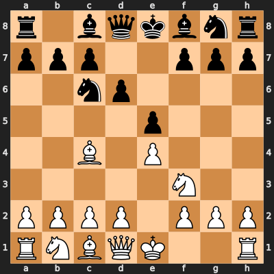

In this project I explore the foundational principles of game-playing AI by implementing the **Min-Max algorithm** for the game of chess. This log will document the process of building an AI that can evaluate board positions and select moves based on a recursive search of future possibilities.

The history of artificial intelligence is deeply intertwined with chess. For decades, the game was considered a "drosophila" for AI research—a complex, well-defined domain perfect for testing new ideas. The ultimate goal was to create a machine that could defeat a reigning human world champion.

This quest culminated in the historic 1997 match between World Champion **Garry Kasparov** and IBM's supercomputer, **Deep Blue**. When Deep Blue won the match, it was a landmark moment. While the machine's victory was the result of a massive engineering effort—including custom hardware capable of evaluating 200 million positions per second, extensive opening books, and endgame tablebases—at its core was a highly optimized version of the algorithm we will investigate today: **Min-Max with Alpha-Beta Pruning**.

My goal is not to build another Deep Blue, but to understand the fundamental logic that powered it. We will build a simplified engine to appreciate the interplay between search depth, evaluation functions, and computational complexity.


```python
# Using the python-chess library for board representation and move generation.
# We'll use cairosvg for rendering the board in the notebook.

import chess
import chess.svg
import time
from IPython.display import display, SVG
```

In reinforcement learning, we talk about an agent interacting with an environment. For our purposes, the environment is the game of chess itself.

*   **State Space (S):** The set of all possible legal chess positions. The number of states is astronomical, estimated by Claude Shannon to be around 10^43. The game-tree complexity (the number of possible game paths) is even higher, at around 10^120.
*   **Action Space (A):** The set of all legal moves from a given position. This changes at every step.

Let's visualize our initial state.


```python
board = chess.Board()
display(SVG(chess.svg.board(board=board, size=400)))
```


    

    


The Min-Max algorithm needs a way to assign a score to a board position, even if it's not a checkmate. This is the role of the **evaluation function**. This function is a heuristic that attempts to capture the principles of chess strategy in a single number. A positive score will favor White, while a negative score will favor Black.

A good evaluation function is the heart of a classical chess engine. We will build one based on two key ideas:

1.  **Material Advantage:** The simplest factor. Each piece has a value, and we can sum them up.
2.  **Positional Advantage:** A piece's value is not static; it depends on its position. A knight in the center of the board is far more powerful than one in a corner. We will use **Piece-Square Tables (PSTs)** to encode this. A PST is a table that assigns a bonus or penalty to a piece based on the square it occupies.

The Piece-Square Tables (PSTs) used below are simplified, illustrative versions that are commonly found in many chess programming tutorials and articles. They are designed to demonstrate the concept of positional evaluation. (https://chess.stackexchange.com/questions/21998/in-chess-engines-a-i-how-are-the-values-for-piece-square-tables-for-simplified)


```python
# Piece-Square Tables (from a simplified perspective)
# These tables are mirrored for black pieces.
pawn_pst = [
    0,  0,  0,  0,  0,  0,  0,  0,
    50, 50, 50, 50, 50, 50, 50, 50,
    10, 10, 20, 30, 30, 20, 10, 10,
    5,  5, 10, 25, 25, 10,  5,  5,
    0,  0,  0, 20, 20,  0,  0,  0,
    5, -5,-10,  0,  0,-10, -5,  5,
    5, 10, 10,-20,-20, 10, 10,  5,
    0,  0,  0,  0,  0,  0,  0,  0
]

knight_pst = [
    -50,-40,-30,-30,-30,-30,-40,-50,
    -40,-20,  0,  0,  0,  0,-20,-40,
    -30,  0, 10, 15, 15, 10,  0,-30,
    -30,  5, 15, 20, 20, 15,  5,-30,
    -30,  0, 15, 20, 20, 15,  0,-30,
    -30,  5, 10, 15, 15, 10,  5,-30,
    -40,-20,  0,  5,  5,  0,-20,-40,
    -50,-40,-30,-30,-30,-30,-40,-50,
]

bishop_pst = [
    -20,-10,-10,-10,-10,-10,-10,-20,
    -10,  0,  0,  0,  0,  0,  0,-10,
    -10,  0,  5, 10, 10,  5,  0,-10,
    -10,  5,  5, 10, 10,  5,  5,-10,
    -10,  0, 10, 10, 10, 10,  0,-10,
    -10, 10, 10, 10, 10, 10, 10,-10,
    -10,  5,  0,  0,  0,  0,  5,-10,
    -20,-10,-10,-10,-10,-10,-10,-20,
]

rook_pst = [
    0,  0,  0,  0,  0,  0,  0,  0,
    5, 10, 10, 10, 10, 10, 10,  5,
    -5,  0,  0,  0,  0,  0,  0, -5,
    -5,  0,  0,  0,  0,  0,  0, -5,
    -5,  0,  0,  0,  0,  0,  0, -5,
    -5,  0,  0,  0,  0,  0,  0, -5,
    -5,  0,  0,  0,  0,  0,  0, -5,
    0,  0,  0,  5,  5,  0,  0,  0
]

queen_pst = [
    -20,-10,-10, -5, -5,-10,-10,-20,
    -10,  0,  0,  0,  0,  0,  0,-10,
    -10,  0,  5,  5,  5,  5,  0,-10,
    -5,  0,  5,  5,  5,  5,  0, -5,
    0,  0,  5,  5,  5,  5,  0, -5,
    -10,  5,  5,  5,  5,  5,  0,-10,
    -10,  0,  5,  0,  0,  0,  0,-10,
    -20,-10,-10, -5, -5,-10,-10,-20
]

king_pst = [
    -30,-40,-40,-50,-50,-40,-40,-30,
    -30,-40,-40,-50,-50,-40,-40,-30,
    -30,-40,-40,-50,-50,-40,-40,-30,
    -30,-40,-40,-50,-50,-40,-40,-30,
    -20,-30,-30,-40,-40,-30,-30,-20,
    -10,-20,-20,-20,-20,-20,-20,-10,
    20, 20,  0,  0,  0,  0, 20, 20,
    20, 30, 10,  0,  0, 10, 30, 20
]
```


```python
# Piece values
piece_values = {
    chess.PAWN: 100, chess.KNIGHT: 320, chess.BISHOP: 330,
    chess.ROOK: 500, chess.QUEEN: 900, chess.KING: 20000
}


piece_psts = {
    chess.PAWN: pawn_pst, chess.KNIGHT: knight_pst, chess.BISHOP: bishop_pst,
    chess.ROOK: rook_pst, chess.QUEEN: queen_pst, chess.KING: king_pst
}

def evaluate_board(board):
    """
    Evaluates the board state and returns a score.
    Positive score is good for White, negative is good for Black.
    """
    if board.is_checkmate():
        if board.turn == chess.WHITE: return -float('inf') # Black wins
        else: return float('inf') # White wins
    if board.is_stalemate() or board.is_insufficient_material() or board.is_seventyfive_moves() or board.is_fivefold_repetition():
        return 0

    score = 0
    for square in chess.SQUARES:
        piece = board.piece_at(square)
        if piece is not None:
            # Material value
            value = piece_values[piece.piece_type]
            # Positional value from PST
            pst = piece_psts[piece.piece_type]
            # The PST is from White's perspective, so we mirror it for Black
            pst_index = square if piece.color == chess.WHITE else chess.square_mirror(square)
            value += pst[pst_index]
            
            if piece.color == chess.WHITE:
                score += value
            else:
                score -= value
    return score
```

## The Min-Max Algorithm with Alpha-Beta Pruning

The Min-Max algorithm explores the tree of possible moves. It assumes both players play optimally.
- **Maximizing Player (Us):** Tries to choose a move that leads to a position with the highest possible score.
- **Minimizing Player (Opponent):** Tries to choose a move that leads to a position with the lowest possible score.

Searching the entire game tree is impossible. We must limit our search to a certain **depth**. A deeper search means a smarter AI, but it also means exponentially more computation.

**Alpha-Beta Pruning** is a critical optimization. It allows us to "prune" entire branches of the game tree that we know cannot influence the final decision, dramatically speeding up the search without affecting the outcome.


```python
def minimax(board, depth, alpha, beta, maximizing_player):
    """Min-Max algorithm with Alpha-Beta Pruning."""
    if depth == 0 or board.is_game_over():
        return evaluate_board(board), None

    best_move = None
    if maximizing_player:
        max_eval = -float('inf')
        for move in board.legal_moves:
            board.push(move)
            evaluation, _ = minimax(board, depth - 1, alpha, beta, False)
            board.pop()
            if evaluation > max_eval:
                max_eval = evaluation
                best_move = move
            alpha = max(alpha, evaluation)
            if beta <= alpha:
                break # Prune
        return max_eval, best_move
    else: # Minimizing player
        min_eval = float('inf')
        for move in board.legal_moves:
            board.push(move)
            evaluation, _ = minimax(board, depth - 1, alpha, beta, True)
            board.pop()
            if evaluation < min_eval:
                min_eval = evaluation
                best_move = move
            beta = min(beta, evaluation)
            if beta <= alpha:
                break # Prune
        return min_eval, best_move

def find_best_move(board, depth):
    """Helper function to initiate the search."""
    start_time = time.time()
    maximizing_player = (board.turn == chess.WHITE)
    score, best_move = minimax(board, depth, -float('inf'), float('inf'), maximizing_player)
    end_time = time.time()
    print(f"Search completed in {end_time - start_time:.4f} seconds.")
    print(f"Best move found: {best_move}")
    print(f"Evaluation score: {score}")
    return best_move
```

## Experiment and Analysis

Let's test our AI. We will set up a board position and ask our engine to find the best move for White. We will use a search depth of 3. A depth of 4 or 5 would be much stronger but would be too slow to run interactively in this notebook.

This is a simple tactical position. White has a potential attack. Let's see if our engine can find a good move.


```python
# A sample tactical position (FEN string)
fen = "r1bqkbnr/ppp2ppp/2np4/4p3/2B1P3/5N2/PPPP1PPP/RNBQK2R w KQkq - 0 4"
board = chess.Board(fen)

print("Board to analyze:")
display(SVG(chess.svg.board(board=board, size=400)))
```

    Board to analyze:


    

    


```python
# Find the best move for White with a depth of 3
search_depth = 3
print(f"\n--- Finding best move for White (Depth: {search_depth}) ---")
best_move = find_best_move(board, search_depth)

# Make the move on the board and display the new state
if best_move:
    board.push(best_move)
    print("\nBoard after AI's move:")
    display(SVG(chess.svg.board(board=board, size=400)))
```

    
    --- Finding best move for White (Depth: 3) ---
    Search completed in 0.3792 seconds.
    Best move found: c4b5
    Evaluation score: 320
    
    Board after AI's move:


    

    


### Summary

1.  **The Power of the Heuristic:** The engine's choice is entirely dependent on the `evaluate_board` function. Our function, which combines material and positional awareness (PSTs), is able to make a reasonable move. A purely material-based evaluation might make a much weaker, less strategic move. The quality of this heuristic is paramount.

2.  **The Horizon Effect:** Our AI can only see `depth` moves into the future. A critical flaw of this approach is the "horizon effect." The engine might happily make a move that leads to a great position in 3 moves, completely oblivious to a checkmate against it on the 4th move. This is why Deep Blue's ability to search to much greater depths (often 12-20 ply, and even more in some positions) was so crucial. It could see the long-term consequences of its actions far better than a human could.

3.  **Computational Cost:** Even with Alpha-Beta pruning, the number of nodes to evaluate grows exponentially with depth. Increasing the search depth from 3 to 4 in our simple Python script would likely increase the search time by a factor of 5-10x or more. This illustrates the need for the specialized hardware and software optimizations that teams like Deep Blue's employed.

4.  **Quiescence Search:** A simple depth limit is problematic. The engine might stop its evaluation in the middle of a chaotic sequence of captures. A common enhancement, not implemented here, is "quiescence search," where the search depth is extended for "non-quiet" positions (like those involving captures) until the position stabilizes. This prevents the engine from making blunders based on an incomplete tactical evaluation.

## Conclusion

This investigation demonstrates the core logic of a classical chess engine. The Min-Max algorithm, when combined with Alpha-Beta pruning and a well-crafted evaluation function, can form a powrful foundation for game-playing AI. I appreciate that while the principles are straightforward, achieving grandmaster-level play as Deep Blue did, is going to be monumental challenge of scale, requiring immense computational power to deepen the search and sophisticated heuristics to sharpen the evaluation.

This study provides a stepping stone to understanding more modern techniques. While Min-Max had dominated for decades, newer approaches like Monte Carlo Tree Search (MCTS) and deep neural networks (eg. AlphaZero) have since redefined the state of the art by learning evaluation functions and search strategies from self-play, rather than having them hand-crafted by human experts.
