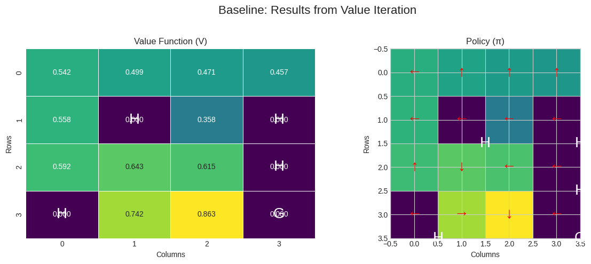
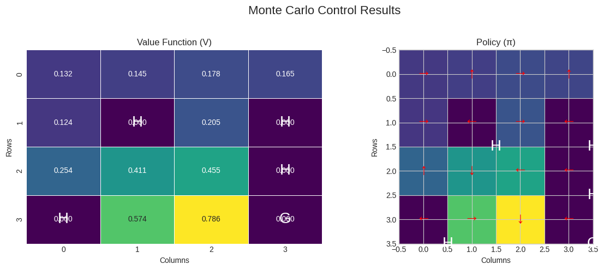
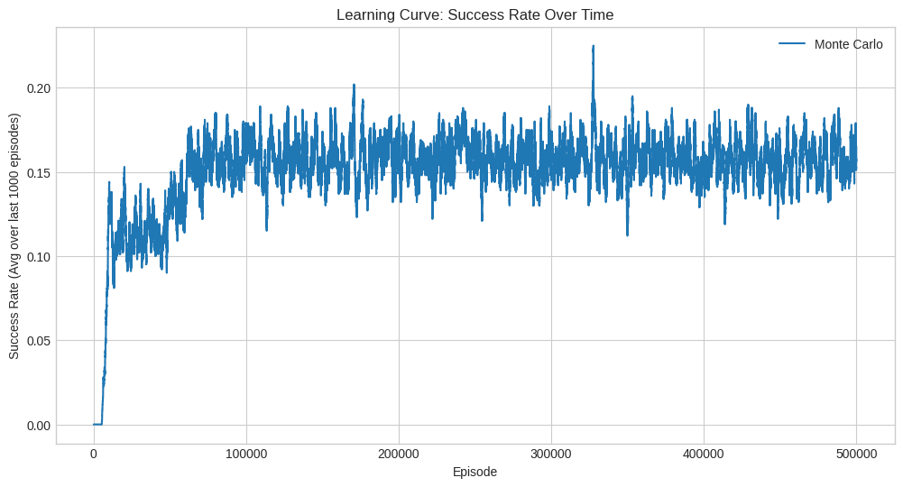

In my previous experiments, I detailed solving the `FrozenLake-v1` environment using both model-based Dynamic Programming and model-free Temporal-Difference methods like SARSA and Q-Learning respectively. I now turn our attention to another fundamental class of model-free reinforcement learning: **Monte Carlo (MC) methods**.

Unlike TD learning, which updates value estimates after every step (bootstrapping), Monte Carlo methods learn only from **complete episodes**. The agent runs through an entire episode from start to finish, and only then are the value estimates for the visited states updated based on the actual, full return that was observed.

My objective is to implement an on-policy Monte Carlo control algorithm to find the optimal policy for `FrozenLake-v1`. We will analyze its performance, convergence properties, and compare the final policy to our ground-truth optimal policy derived from Value Iteration. This will allow us to understand the practical trade-offs between MC and TD learning.


```python
import gym
import numpy as np
import matplotlib.pyplot as plt
import seaborn as sns
import pandas as pd
from collections import defaultdict

# Use a consistent style for plots
plt.style.use('seaborn-v0_8-whitegrid')
```

## 1. Environment Setup and Baseline


```python
# Initialize the environment
env = gym.make('FrozenLake-v1', is_slippery=True, render_mode='rgb_array')
unwrapped_env = env.unwrapped # For accessing the model P

n_states = unwrapped_env.observation_space.n
n_actions = unwrapped_env.action_space.n

action_names = {0: 'Left', 1: 'Down', 2: 'Right', 3: 'Up'}
action_symbols = {0: '←', 1: '↓', 2: '→', 3: '↑'}

print(f"Number of States: {n_states}")
print(f"Number of Actions: {n_actions}")
```

    Number of States: 16
    Number of Actions: 4


### Baseline: The Optimal Policy (via Value Iteration)

As in our previous studies, we first compute the true optimal policy using Value Iteration. This gives us a stable benchmark against which we can measure the success of our Monte Carlo agent.


```python
def value_iteration(env, gamma=0.99, theta=1e-8):
    """Performs Value Iteration to find the optimal value function."""
    V = np.zeros(env.observation_space.n)
    while True:
        delta = 0
        for s in range(env.observation_space.n):
            v = V[s]
            q_sa = np.zeros(env.action_space.n)
            for a in range(env.action_space.n):
                for prob, next_s, reward, _ in env.P[s][a]:
                    q_sa[a] += prob * (reward + gamma * V[next_s])
            V[s] = np.max(q_sa)
            delta = max(delta, np.abs(v - V[s]))
        if delta < theta:
            break
    policy = np.zeros(env.observation_space.n, dtype=int)
    for s in range(env.observation_space.n):
        q_sa = np.zeros(env.action_space.n)
        for a in range(env.action_space.n):
            for prob, next_s, reward, _ in env.P[s][a]:
                q_sa[a] += prob * (reward + gamma * V[next_s])
        policy[s] = np.argmax(q_sa)
    return V, policy

optimal_V_vi, optimal_policy_vi = value_iteration(unwrapped_env)
```


```python
def plot_results(V, policy, title):
    """Helper function to plot the value function and policy."""
    fig, ax = plt.subplots(1, 2, figsize=(12, 5))
    fig.suptitle(title, fontsize=16)
    
    V_reshaped = V.reshape(4, 4)
    sns.heatmap(V_reshaped, annot=True, fmt=".3f", cmap="viridis", cbar=False, ax=ax[0], linewidths=.5)
    ax[0].set_title("Value Function (V)")
    ax[0].set_xlabel("Columns")
    ax[0].set_ylabel("Rows")
    
    policy_reshaped = policy.reshape(4, 4)
    ax[1].imshow(V_reshaped, cmap="viridis")
    ax[1].set_title("Policy (π)")
    ax[1].set_xlabel("Columns")
    ax[1].set_ylabel("Rows")
    
    for r in range(4):
        for c in range(4):
            action = policy_reshaped[r, c]
            arrow = action_symbols[action]
            ax[1].text(c, r, arrow, ha='center', va='center', color='red', fontsize=20)
            
    desc = unwrapped_env.desc.astype(str)
    for r in range(4):
        for c in range(4):
            if desc[r, c] in 'HG':
                ax[0].text(c + 0.5, r + 0.5, desc[r, c], ha='center', va='center', color='white', fontsize=20)
                ax[1].text(c + 0.5, r + 0.5, desc[r, c], ha='center', va='center', color='white', fontsize=20)

    plt.tight_layout(rect=[0, 0, 1, 0.96])
    plt.show()

plot_results(optimal_V_vi, optimal_policy_vi, "Baseline: Results from Value Iteration")
```


    

    


## 2. On-Policy First-Visit Monte Carlo Control

To find an optimal policy, we need to estimate the action-value function, `Q(s, a)`. The core idea of MC control is to follow the principle of **Generalized Policy Iteration (GPI)**: we alternate between evaluating the current policy and improving it.

1.  **Policy Evaluation**: We run many episodes using our current policy. For each state-action pair `(s, a)` visited, we calculate the total discounted reward (the return `G`) from its *first* occurrence in each episode. We then average these returns to estimate `Q(s, a)`.
    $$Q(s, a) \leftarrow \text{average}(\text{Returns}(s, a))$$
2.  **Policy Improvement**: After updating the Q-values, we improve our policy by making it greedy with respect to the new Q-function. 

A critical challenge is ensuring sufficient exploration. If our policy becomes deterministic, we might never try certain actions and thus never learn their true value. To solve this, we use an **ε-soft policy** (specifically, ε-greedy), which ensures that all actions have a non-zero probability of being selected.


```python
def on_policy_first_visit_mc_control(env, n_episodes, gamma, epsilon):
    """
    On-policy first-visit Monte Carlo control for ε-soft policies.
    """
    # Initialize Q(s, a) and the return tracking dictionaries
    Q = defaultdict(lambda: np.zeros(env.action_space.n))
    returns_sum = defaultdict(float)
    returns_count = defaultdict(float)
    
    # The policy is derived from Q, but we can think of it as ε-greedy
    def get_policy(state):
        probs = np.ones(env.action_space.n) * epsilon / env.action_space.n
        best_action = np.argmax(Q[state])
        probs[best_action] += 1.0 - epsilon
        return probs

    rewards_per_episode = []

    for i in range(n_episodes):
        if (i + 1) % 50000 == 0:
            print(f"Episode {i + 1}/{n_episodes}")
            
        # 1. Generate an episode
        episode_history = []
        state, info = env.reset()
        terminated = False
        truncated = False
        
        while not terminated and not truncated:
            policy_probs = get_policy(state)
            action = np.random.choice(np.arange(env.action_space.n), p=policy_probs)
            next_state, reward, terminated, truncated, info = env.step(action)
            episode_history.append((state, action, reward))
            state = next_state
        
        # Track success for learning curve
        rewards_per_episode.append(reward)

        # 2. Update Q-values (Policy Evaluation)
        G = 0
        visited_sa_pairs = set()
        # Iterate backwards through the episode
        for t in range(len(episode_history) - 1, -1, -1):
            state, action, reward = episode_history[t]
            G = gamma * G + reward
            
            # First-visit MC: only update on the first time we see (s, a)
            if (state, action) not in visited_sa_pairs:
                visited_sa_pairs.add((state, action))
                
                returns_sum[(state, action)] += G
                returns_count[(state, action)] += 1.0
                Q[state][action] = returns_sum[(state, action)] / returns_count[(state, action)]
                # Policy is implicitly improved because get_policy() uses the updated Q

    # Derive final deterministic policy and V function from Q
    final_policy = np.zeros(env.observation_space.n, dtype=int)
    V = np.zeros(env.observation_space.n)
    for s in range(env.observation_space.n):
        final_policy[s] = np.argmax(Q[s])
        V[s] = np.max(Q[s])
    
    return V, final_policy, rewards_per_episode
```

### 3. Experiment and Results


```python
# Monte Carlo parameters
# MC methods often require many more episodes than TD methods due to high variance.
n_episodes_mc = 500000 
gamma_mc = 0.99
epsilon_mc = 0.1 # For the ε-soft policy

print("--- Running On-Policy First-Visit MC Control ---")
V_mc, policy_mc, rewards_mc = on_policy_first_visit_mc_control(
    env, n_episodes_mc, gamma_mc, epsilon_mc
)

plot_results(V_mc, policy_mc, "Monte Carlo Control Results")
```

    --- Running On-Policy First-Visit MC Control ---
    Episode 50000/500000
    Episode 100000/500000
    Episode 150000/500000
    Episode 200000/500000
    Episode 250000/500000
    Episode 300000/500000
    Episode 350000/500000
    Episode 400000/500000
    Episode 450000/500000
    Episode 500000/500000


    

    


**Observation on MC Policy:**

The policy learned by Monte Carlo was quite good and finds a valid path to the goal. However, it seemed to differ slightly from the true optimal policy found by Value Iteration. This is because MC is optimizing a policy that is ε-soft—it always maintains a small probability of exploration. This can make it slightly more conservative, similar to what we observed with on-policy SARSA. The high number of episodes was necessary to average out the high variance inherent in the stochastic `FrozenLake` environment; each episode's return can vary significantly even with the same policy.

### Learning Curve Analysis


```python
def plot_learning_curve(rewards, window_size=1000):
    """Plots the success rate over time."""
    # Calculate success rate over a sliding window
    success_rate = pd.Series(rewards).rolling(window_size, min_periods=1).mean()
    
    plt.figure(figsize=(12, 6))
    plt.plot(success_rate, label='Monte Carlo')
    plt.title('Learning Curve: Success Rate Over Time')
    plt.xlabel('Episode')
    plt.ylabel(f'Success Rate (Avg over last {window_size} episodes)')
    plt.legend()
    plt.grid(True)
    plt.show()

plot_learning_curve(rewards_mc)
```


    

    


The learning curve shows a clear positive trend, but it's also quite noisy, which is characteristic of MC methods. The agent's performance improves as it explores more episodes and gets better estimates of the Q-values, but the inherent randomness of the environment and the policy leads to high variance in short-term success.


```python
print("--- Final Policy Comparison ---")
policy_match = np.array_equal(optimal_policy_vi, policy_mc)
print(f"Value Iteration vs. Monte Carlo policies identical: {policy_match}")

if not policy_match:
    diffs = np.sum(optimal_policy_vi != policy_mc)
    print(f"Number of differing actions in policies: {diffs} out of {n_states}")

env.close()
```

    --- Final Policy Comparison ---
    Value Iteration vs. Monte Carlo policies identical: False
    Number of differing actions in policies: 4 out of 16


## 4. Summary

1.  **MC is Unbiased, Model-Free Learning:** MC methods successfully learn a near-optimal policy without any knowledge of the environment's dynamics. Because they learn from actual, complete returns, their value estimates are unbiased, unlike the bootstrapped (and therefore biased) estimates of TD methods.

2.  **High Variance can be a Major Factor:** The primary drawback observed was high variance. The return of a single episode can be very different from the next due to the stochasticity of both the environment and the policy. This necessitates a very large number of episodes to ensure the law of large numbers provides a good average, making MC methods computationally intensive and slow to converge.

3.  **Episodic Tasks Only?** MC methods are only applicable to episodic tasks, as they seem to require a terminal state to calculate the return `G`. They may not be used in continuous, non-terminating environments.

4.  **On-Policy vs. Off-Policy:** We implemented an on-policy version, which learns the value of its own exploratory (ε-soft) policy. This can lead to safer, more conservative policies, similar to SARSA. An off-policy version (using importance sampling) could be used to learn the optimal policy directly, akin to Q-Learning, but often suffers from even higher variance.
