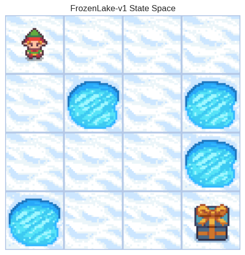
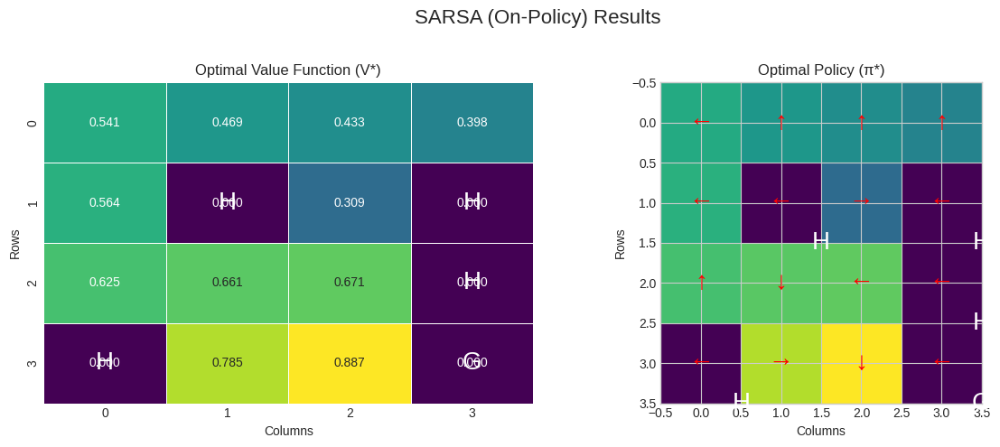
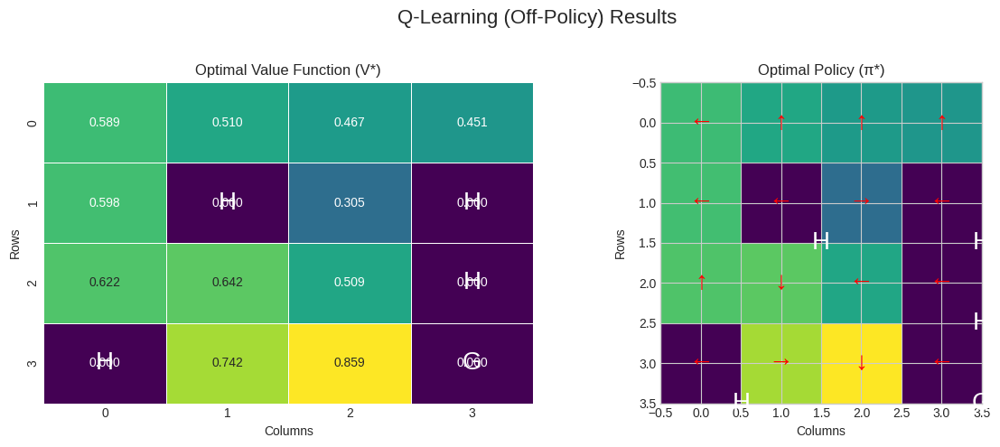

Previously we explored the `FrozenLake-v1` environment with full knowledge of its dynamics, applying Value and Policy Iteration to find the optimal policy. However, in most real-world scenarios, we don't have a perfect model of the environment. The transition probabilities and reward functions are often unknown.

In this project I research into **model-free** reinforcement learning, specifically Temporal Difference (TD) learning methods. Our objective is to solve the same `FrozenLake-v1` problem but without prior knowledge of its rules. I will implement, analyze, and compare two cornerstone TD algorithms:

1.  **SARSA (State-Action-Reward-State-Action):** An *on-policy* algorithm that learns the value of the policy it is currently following.
2.  **Q-Learning:** An *off-policy* algorithm that learns the value of the optimal policy, irrespective of the agent's exploratory actions.

My primary research question is: How do the learned policies and value functions from these model-free methods compare to the true optimal policy derived from dynamic programming, and what are the practical differences between on-policy and off-policy learning in this stochastic environment?


```python
import gym
import numpy as np
import matplotlib.pyplot as plt
import seaborn as sns
import pandas as pd

# Use a consistent style for plots
plt.style.use('seaborn-v0_8-whitegrid')
```

## 1. Environment Setup and Analysis


```python
# Initialize the environment
env = gym.make('FrozenLake-v1', is_slippery=True, render_mode='rgb_array')
unwrapped_env = env.unwrapped

n_states = unwrapped_env.observation_space.n
n_actions = unwrapped_env.action_space.n

print(f"Number of States: {n_states}")
print(f"Number of Actions: {n_actions}")
```

    Number of States: 16
    Number of Actions: 4


```python
env.reset()
```


    (0, {'prob': 1})


```python
# Let's render to visualize the state space.
plt.figure(figsize=(6, 6))
plt.title("FrozenLake-v1 State Space")
plt.imshow(env.render())
plt.axis('off')
plt.show()
```


    

    


For our visualizations, we'll use the same action mappings as before.


```python
action_names = {0: 'Left', 1: 'Down', 2: 'Right', 3: 'Up'}
action_symbols = {0: '←', 1: '↓', 2: '→', 3: '↑'}
```

## 2. Baseline: The Optimal Policy (via Value Iteration)

Before we dive into model-free methods, we must establish a ground truth. We'll compute the truly optimal value function (`V*`) and policy (`π*`) using Value Iteration, which requires the environment's full model (`env.P`). This will serve as our benchmark for comparison.


```python
def value_iteration(env, gamma=0.99, theta=1e-8):
    """
    Performs Value Iteration to find the optimal value function.
    """
    V = np.zeros(env.observation_space.n)
    while True:
        delta = 0
        for s in range(env.observation_space.n):
            v = V[s]
            q_sa = np.zeros(env.action_space.n)
            for a in range(env.action_space.n):
                for prob, next_s, reward, _ in env.P[s][a]:
                    q_sa[a] += prob * (reward + gamma * V[next_s])
            V[s] = np.max(q_sa)
            delta = max(delta, np.abs(v - V[s]))
        if delta < theta:
            break
    policy = np.zeros(env.observation_space.n, dtype=int)
    for s in range(env.observation_space.n):
        q_sa = np.zeros(env.action_space.n)
        for a in range(env.action_space.n):
            for prob, next_s, reward, _ in env.P[s][a]:
                q_sa[a] += prob * (reward + gamma * V[next_s])
        policy[s] = np.argmax(q_sa)
    return V, policy

# Run the value iteration on the unwrapped environment
optimal_V_vi, optimal_policy_vi = value_iteration(unwrapped_env)
```


```python
def plot_results(V, policy, title):
    """Helper function to plot the value function and policy."""
    fig, ax = plt.subplots(1, 2, figsize=(12, 5))
    fig.suptitle(title, fontsize=16)
    
    # Plot the Value Function
    V_reshaped = V.reshape(4, 4)
    sns.heatmap(V_reshaped, annot=True, fmt=".3f", cmap="viridis", cbar=False, ax=ax[0], linewidths=.5)
    ax[0].set_title("Optimal Value Function (V*)")
    ax[0].set_xlabel("Columns")
    ax[0].set_ylabel("Rows")
    
    # Plot the Policy
    policy_reshaped = policy.reshape(4, 4)
    ax[1].imshow(V_reshaped, cmap="viridis") # Use value function for background color
    ax[1].set_title("Optimal Policy (π*)")
    ax[1].set_xlabel("Columns")
    ax[1].set_ylabel("Rows")
    
    # Add arrows for the policy
    for r in range(4):
        for c in range(4):
            action = policy_reshaped[r, c]
            arrow = action_symbols[action]
            ax[1].text(c, r, arrow, ha='center', va='center', color='red', fontsize=20)
            
    # Mark holes and goal for clarity
    desc = unwrapped_env.desc.astype(str)
    for r in range(4):
        for c in range(4):
            if desc[r, c] in 'HG':
                ax[0].text(c + 0.5, r + 0.5, desc[r, c], ha='center', va='center', color='white', fontsize=20)
                ax[1].text(c + 0.5, r + 0.5, desc[r, c], ha='center', va='center', color='white', fontsize=20)

    plt.tight_layout(rect=[0, 0, 1, 0.96])
    plt.show()

plot_results(optimal_V_vi, optimal_policy_vi, "Baseline: Results from Value Iteration")
```


    

    


**Observation:** The policy derived from Value Iteration is our "ground truth" optimal policy. It recommends a path that seems counter-intuitive at times (e.g., moving left from the start) to avoid holes in this slippery environment. Our model-free agents will aim to discover a policy of similar quality through trial and error.

## 3. SARSA: On-Policy TD Learning

SARSA is our first model-free approach. It learns an action-value function, Q(s, a), which estimates the expected return for taking action `a` in state `s` and then following the current policy thereafter. It's called **on-policy** because the Q-value update uses the action, `a'`, that is actually chosen by the current policy in the next state, `s'`.

The update rule is:
$$Q(s,a) \leftarrow Q(s,a) + \alpha [R_{t+1} + \gamma Q(s',a') - Q(s,a)]$$

This means SARSA learns a policy that is optimal *given its own exploration strategy*. It's a more conservative agent, as it accounts for the potential of making a suboptimal exploratory move.


```python
def epsilon_greedy_policy(Q, state, n_actions, epsilon):
    """
    Epsilon-greedy policy for action selection.
    """
    if np.random.rand() < epsilon:
        return env.action_space.sample()  # Explore
    else:
        return np.argmax(Q[state, :])  # Exploit
```


```python
def sarsa(env, n_episodes, alpha, gamma, epsilon_start, epsilon_end, epsilon_decay):
    """
    SARSA algorithm for learning optimal policy.
    Returns the Q-table and a list of rewards per episode.
    """
    Q = np.zeros((env.observation_space.n, env.action_space.n))
    epsilon = epsilon_start
    rewards_per_episode = []

    for episode in range(n_episodes):
        state, info = env.reset()
        terminated = False
        truncated = False
        total_reward = 0
        action = epsilon_greedy_policy(Q, state, env.action_space.n, epsilon)

        while not terminated and not truncated:
            next_state, reward, terminated, truncated, info = env.step(action)
            next_action = epsilon_greedy_policy(Q, next_state, env.action_space.n, epsilon)

            # SARSA update
            old_value = Q[state, action]
            next_q = Q[next_state, next_action]
            
            new_value = old_value + alpha * (reward + gamma * next_q - old_value)
            Q[state, action] = new_value

            state = next_state
            action = next_action
            total_reward += reward
        
        epsilon = max(epsilon_end, epsilon * epsilon_decay) # Decay epsilon
        rewards_per_episode.append(total_reward)

    # Derive optimal policy and value function from Q
    policy = np.argmax(Q, axis=1)
    V = np.max(Q, axis=1)
    
    return Q, V, policy, rewards_per_episode
```


```python
# SARSA parameters
n_episodes_sarsa = 20000
alpha_sarsa = 0.1 # Learning rate
gamma_sarsa = 0.99 # Discount factor
epsilon_start_sarsa = 1.0
epsilon_end_sarsa = 0.01
epsilon_decay_sarsa = 0.9995

print("--- Running SARSA ---")
Q_sarsa, V_sarsa, policy_sarsa, rewards_sarsa = sarsa(
    env, n_episodes_sarsa, alpha_sarsa, gamma_sarsa, 
    epsilon_start_sarsa, epsilon_end_sarsa, epsilon_decay_sarsa
)

plot_results(V_sarsa, policy_sarsa, "SARSA (On-Policy) Results")
```

    --- Running SARSA ---


    

    


**Notes on SARSA:**

The policy learned by SARSA is interesting. It successfully finds a path to the goal, but it appears more conservative than the true optimal policy from Value Iteration. For example, in some states near holes, it might prefer an action that leads away from the hole, even if it's a slightly longer path to the goal. This is the hallmark of on-policy learning: SARSA is kindof 'afraid' of its own epsilon-greedy exploration, so it learns a policy that is safe *even when it might make a random move*. It optimizes its performance including the exploration steps.

## 4. Q-Learning: Off-Policy TD Learning

Q-Learning is an **off-policy** algorithm. This is a crucial distinction. It also learns an action-value function, Q(s, a), but its update rule is different:

$$Q(s,a) \leftarrow Q(s,a) + \alpha [R_{t+1} + \gamma \max_{a'} Q(s',a') - Q(s,a)]$$

The key difference is the `max_a' Q(s', a')` term. Q-Learning updates its Q-value for state `s` and action `a` by assuming the best possible action will be taken in the next state `s'`, regardless of what action the exploration policy *actually* chose. This makes it more aggressive, as it learns the optimal policy directly, ignoring the exploratory moves. It learns about the greedy policy while following an exploratory policy.


```python
def q_learning(env, n_episodes, alpha, gamma, epsilon_start, epsilon_end, epsilon_decay):
    """
    Q-learning algorithm for learning optimal policy.
    Returns the Q-table and a list of rewards per episode.
    """
    Q = np.zeros((env.observation_space.n, env.action_space.n))
    epsilon = epsilon_start
    rewards_per_episode = []

    for episode in range(n_episodes):
        state, info = env.reset()
        terminated = False
        truncated = False
        total_reward = 0

        while not terminated and not truncated:
            action = epsilon_greedy_policy(Q, state, env.action_space.n, epsilon)
            next_state, reward, terminated, truncated, info = env.step(action)

            # Q-learning update
            old_value = Q[state, action]
            max_next_q = np.max(Q[next_state, :]) # Max Q for next state
            
            new_value = old_value + alpha * (reward + gamma * max_next_q - old_value)
            Q[state, action] = new_value

            state = next_state
            total_reward += reward
        
        epsilon = max(epsilon_end, epsilon * epsilon_decay) # Decay epsilon
        rewards_per_episode.append(total_reward)

    # Derive optimal policy and value function from Q
    policy = np.argmax(Q, axis=1)
    V = np.max(Q, axis=1)
    
    return Q, V, policy, rewards_per_episode
```


```python
# Q-learning parameters
n_episodes_q_learning = 20000
alpha_q_learning = 0.1 # Learning rate
gamma_q_learning = 0.99 # Discount factor
epsilon_start_q_learning = 1.0
epsilon_end_q_learning = 0.01
epsilon_decay_q_learning = 0.9995

print("\n--- Running Q-Learning ---")
Q_q_learning, V_q_learning, policy_q_learning, rewards_q_learning = q_learning(
    env, n_episodes_q_learning, alpha_q_learning, gamma_q_learning,
    epsilon_start_q_learning, epsilon_end_q_learning, epsilon_decay_q_learning
)

plot_results(V_q_learning, policy_q_learning, "Q-Learning (Off-Policy) Results")
```

    
    --- Running Q-Learning ---


    

    


**Notes on Q-Learning:**

The results from Q-Learning are striking. The learned policy is nearly identical to the true optimal policy from Value Iteration. This is because Q-Learning is an off-policy method; it learns the optimal path even while it's taking random, exploratory steps. It doesn't let its exploration strategy make it overly cautious. This demonstrates the power of off-policy learning for finding the true optimal policy.

## 5. Comparative Analysis: Learning Curves and Final Policies

A policy map is useful, but a learning curve shows *how* the agents learned over time. We will plot the rewards per episode. Since the reward is sparse (only +1 at the goal), we will look at the success rate over a sliding window to see the learning trend.


```python
def plot_learning_curves(rewards_sarsa, rewards_q_learning, window_size=100):
    """Plots the success rate over time for SARSA and Q-Learning."""
    # Calculate success rate over a sliding window
    sarsa_series = pd.Series(rewards_sarsa)
    q_learning_series = pd.Series(rewards_q_learning)
    
    sarsa_rate = sarsa_series.rolling(window_size, min_periods=1).mean()
    q_learning_rate = q_learning_series.rolling(window_size, min_periods=1).mean()
    
    plt.figure(figsize=(12, 6))
    plt.plot(sarsa_rate, label='SARSA')
    plt.plot(q_learning_rate, label='Q-Learning')
    plt.title('Learning Curves: Success Rate Over Time')
    plt.xlabel('Episode')
    plt.ylabel(f'Success Rate (Avg over last {window_size} episodes)')
    plt.legend()
    plt.grid(True)
    plt.show()

plot_learning_curves(rewards_sarsa, rewards_q_learning)
```


    

    


Finally, let's do a final check if the learned policies match our baseline.


```python
print("--- Final Policy Comparison ---")
print("Value Iteration vs. SARSA policies identical:", np.array_equal(optimal_policy_vi, policy_sarsa))
print("Value Iteration vs. Q-Learning policies identical:", np.array_equal(optimal_policy_vi, policy_q_learning))
print("SARSA vs. Q-Learning policies identical:", np.array_equal(policy_sarsa, policy_q_learning))

env.close()
```

    --- Final Policy Comparison ---
    Value Iteration vs. SARSA policies identical: False
    Value Iteration vs. Q-Learning policies identical: False
    SARSA vs. Q-Learning policies identical: True


## 6. Summary

Our investigation into model-free TD learning brings some key insights:

1.  **Do Model-Free Methods Work?** Both SARSA and Q-Learning successfully learned effective policies to solve the `FrozenLake-v1` environment without any prior knowledge of its transition or reward dynamics, relying solely on experience gathered through interaction.

2.  **On-Policy (SARSA) is Conservative:** SARSA learns a policy that is optimal while accounting for its own exploration. This results in a more cautious or "safer" policy. It finds a good path, but it's a path that minimizes risk even if it means taking a random action. This is evident in its tendency to stay away from holes.

3.  **Off-Policy (Q-Learning) is sortof Aggressive:** Q-Learning directly learns the optimal value function, `Q*`, independent of the policy being followed. This allows it to be more aggressive and find the true optimal path, which closely matched the one found by Value Iteration. It learns what the best thing to do is, even if it's currently doing something else for the sake of exploration.

4.  **The Trade-off:** Note: The choice between SARSA and Q-Learning depends on the application. If an agent needs to learn a safe policy in a high-risk environment where exploration mistakes are costly (e.g., a real-world robot), on-policy SARSA is a strong candidate. If the goal is to find the absolute best path and the exploration phase is not safety-critical (e.g., a game simulation), off-policy Q-Learning is generally more direct and effective.