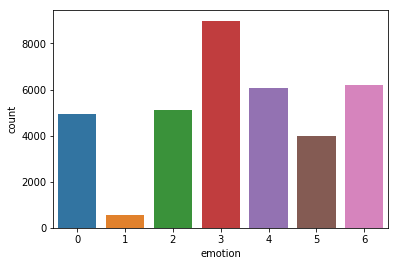
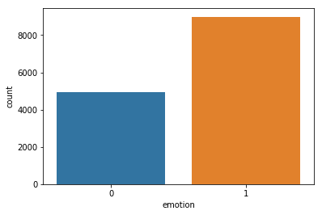
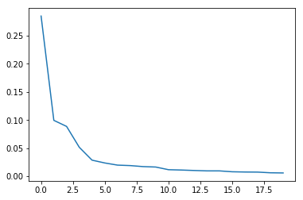
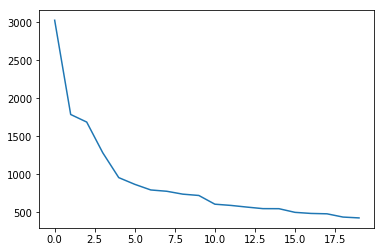
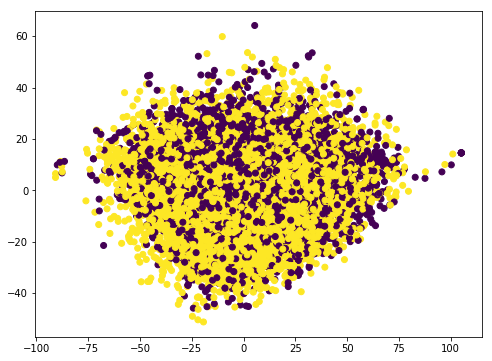

In this project I test SVM on facial expression data: https://www.kaggle.com/c/challenges-in-representation-learning-facial-expression-recognition-challenge. Here I only deal with two label classes: Happy and Angry.


```python
import numpy as np
import pandas as pd
import seaborn as sns
import matplotlib.pyplot as plt
from sklearn.model_selection import GridSearchCV
from sklearn.svm import SVC
from sklearn.preprocessing import StandardScaler
from sklearn.decomposition import PCA
from sklearn.model_selection import train_test_split
from sklearn.metrics import classification_report,confusion_matrix
%matplotlib inline
```


```python
filename = "fer2013/fer2013.csv";
df = pd.read_csv(filename)
print(df.head())
sns.countplot(x='emotion',data=df)
```

       emotion                                             pixels     Usage
    0        0  70 80 82 72 58 58 60 63 54 58 60 48 89 115 121...  Training
    1        0  151 150 147 155 148 133 111 140 170 174 182 15...  Training
    2        2  231 212 156 164 174 138 161 173 182 200 106 38...  Training
    3        4  24 32 36 30 32 23 19 20 30 41 21 22 32 34 21 1...  Training
    4        6  4 0 0 0 0 0 0 0 0 0 0 0 3 15 23 28 48 50 58 84...  Training


    <matplotlib.axes._subplots.AxesSubplot at 0x7f56745fa910>





```python
binary = True  #read labels 3 and 4 only 
if binary:
    df = df[(df['emotion']==3) | (df['emotion']==0)]
    df['emotion'] = df['emotion'].apply(lambda x: 0 if x == 0 else 1)
X = df['pixels']
y = df['emotion']
```

### Data Exploration


```python
sns.countplot(x=y)
```


    <matplotlib.axes._subplots.AxesSubplot at 0x7f5674676a10>





We parse input as string of pixels to list of nparrays


```python
def splitFloat(x):
    splitted = x.split(" ")
    i = 0
    for item in splitted:
        splitted[i]=float(item)
        i=i+1
    return splitted

def parseImageInput(X,y):
    X = X.apply(lambda x: splitFloat(x))
    X = np.array(X)
    X = np.stack(X,axis=0)
    y = np.array(y)
    return X,y
```


```python
X,y = parseImageInput(X,y)
```

The SVM was taking quite long to run on the data X of dimensionality 13942x2304. Here I use PCA to reduce dimentionality to 13942x20.


```python
scaler = StandardScaler()
scaler.fit(X)
scaled_X = scaler.transform(X)
```


```python
pca = PCA(n_components=20)
pca.fit(scaled_X)
scaled_X_pca = pca.transform(scaled_X)
```


```python
plt.plot(pca.explained_variance_ratio_)
```


    [<matplotlib.lines.Line2D at 0x7f5649726c10>]





```python
plt.plot(pca.singular_values_)
```


    [<matplotlib.lines.Line2D at 0x7f5647a92110>]





```python
X_train, X_test, y_train, y_test = train_test_split(scaled_X_pca, y, test_size=0.2, random_state=42)
```


```python
plt.figure(figsize=(8,6))
plt.scatter(scaled_X_pca[:,0],scaled_X_pca[:,1],c=y)
```


    <matplotlib.collections.PathCollection at 0x7f5649a075d0>





Since the data is looks linearly inseparable, we will use non-linear kernel.


```python
model = SVC(kernel='rbf')
model.fit(X_train, y_train)
```


    SVC(C=1.0, cache_size=200, class_weight=None, coef0=0.0,
      decision_function_shape='ovr', degree=3, gamma='auto', kernel='rbf',
      max_iter=-1, probability=False, random_state=None, shrinking=True,
      tol=0.001, verbose=False)


```python
pred = model.predict(X_test)
```


```python
error = np.mean(y_test != pred)
print(error)
```

    0.3180351380423091


```python
print(confusion_matrix(y_test,pred))
print(classification_report(y_test, pred))
```

    [[ 101  886]
     [   1 1801]]
                 precision    recall  f1-score   support
    
              0       0.99      0.10      0.19       987
              1       0.67      1.00      0.80      1802
    
    avg / total       0.78      0.68      0.58      2789
    


We got test-accuracy of 69 percent. Note than PCA with n-dims=100 gives very similar numbers. So the dimensionality reduction to 20 did give us speed without loss in accuracy. Now, lets find better params for SVM to see if we can improve over this.


```python
param_grid = {'C':[0.1,1,10,100],'gamma':[1,0.1,0.01,0.001]}
grid = GridSearchCV(SVC(),param_grid, verbose=2)
```


```python
grid.fit(X_train,y_train)
```

    Fitting 3 folds for each of 16 candidates, totalling 48 fits
    [CV] C=0.1, gamma=1 ..................................................
    [CV] ................................... C=0.1, gamma=1, total=   2.9s
    [CV] C=0.1, gamma=1 ..................................................


    [Parallel(n_jobs=1)]: Done   1 out of   1 | elapsed:    4.5s remaining:    0.0s


    [CV] ................................... C=0.1, gamma=1, total=   3.1s
    [CV] C=0.1, gamma=1 ..................................................
    [CV] ................................... C=0.1, gamma=1, total=   3.0s
    [CV] C=0.1, gamma=0.1 ................................................
    [CV] ................................. C=0.1, gamma=0.1, total=   4.3s
    [CV] C=0.1, gamma=0.1 ................................................
    [CV] ................................. C=0.1, gamma=0.1, total=   4.5s
    [CV] C=0.1, gamma=0.1 ................................................
    [CV] ................................. C=0.1, gamma=0.1, total=   4.3s
    [CV] C=0.1, gamma=0.01 ...............................................
    [CV] ................................ C=0.1, gamma=0.01, total=   4.2s
    [CV] C=0.1, gamma=0.01 ...............................................
    [CV] ................................ C=0.1, gamma=0.01, total=   4.6s
    [CV] C=0.1, gamma=0.01 ...............................................
    [CV] ................................ C=0.1, gamma=0.01, total=   4.3s
    [CV] C=0.1, gamma=0.001 ..............................................
    [CV] ............................... C=0.1, gamma=0.001, total=   3.7s
    [CV] C=0.1, gamma=0.001 ..............................................
    [CV] ............................... C=0.1, gamma=0.001, total=   3.5s
    [CV] C=0.1, gamma=0.001 ..............................................
    [CV] ............................... C=0.1, gamma=0.001, total=   3.8s
    [CV] C=1, gamma=1 ....................................................
    [CV] ..................................... C=1, gamma=1, total=   3.5s
    [CV] C=1, gamma=1 ....................................................
    [CV] ..................................... C=1, gamma=1, total=   3.4s
    [CV] C=1, gamma=1 ....................................................
    [CV] ..................................... C=1, gamma=1, total=   3.4s
    [CV] C=1, gamma=0.1 ..................................................
    [CV] ................................... C=1, gamma=0.1, total=   4.7s
    [CV] C=1, gamma=0.1 ..................................................
    [CV] ................................... C=1, gamma=0.1, total=   4.6s
    [CV] C=1, gamma=0.1 ..................................................
    [CV] ................................... C=1, gamma=0.1, total=   4.8s
    [CV] C=1, gamma=0.01 .................................................
    [CV] .................................. C=1, gamma=0.01, total=   4.4s
    [CV] C=1, gamma=0.01 .................................................
    [CV] .................................. C=1, gamma=0.01, total=   4.5s
    [CV] C=1, gamma=0.01 .................................................
    [CV] .................................. C=1, gamma=0.01, total=   4.6s
    [CV] C=1, gamma=0.001 ................................................
    [CV] ................................. C=1, gamma=0.001, total=   3.7s
    [CV] C=1, gamma=0.001 ................................................
    [CV] ................................. C=1, gamma=0.001, total=   3.3s
    [CV] C=1, gamma=0.001 ................................................
    [CV] ................................. C=1, gamma=0.001, total=   3.2s
    [CV] C=10, gamma=1 ...................................................
    [CV] .................................... C=10, gamma=1, total=   5.8s
    [CV] C=10, gamma=1 ...................................................
    [CV] .................................... C=10, gamma=1, total=   5.4s
    [CV] C=10, gamma=1 ...................................................
    [CV] .................................... C=10, gamma=1, total=   6.5s
    [CV] C=10, gamma=0.1 .................................................
    [CV] .................................. C=10, gamma=0.1, total=   9.2s
    [CV] C=10, gamma=0.1 .................................................
    [CV] .................................. C=10, gamma=0.1, total=   9.1s
    [CV] C=10, gamma=0.1 .................................................
    [CV] .................................. C=10, gamma=0.1, total=   9.0s
    [CV] C=10, gamma=0.01 ................................................
    [CV] ................................. C=10, gamma=0.01, total=   4.8s
    [CV] C=10, gamma=0.01 ................................................
    [CV] ................................. C=10, gamma=0.01, total=   4.9s
    [CV] C=10, gamma=0.01 ................................................
    [CV] ................................. C=10, gamma=0.01, total=   4.6s
    [CV] C=10, gamma=0.001 ...............................................
    [CV] ................................ C=10, gamma=0.001, total=   4.4s
    [CV] C=10, gamma=0.001 ...............................................
    [CV] ................................ C=10, gamma=0.001, total=   4.5s
    [CV] C=10, gamma=0.001 ...............................................
    [CV] ................................ C=10, gamma=0.001, total=   4.5s
    [CV] C=100, gamma=1 ..................................................
    [CV] ................................... C=100, gamma=1, total=   5.8s
    [CV] C=100, gamma=1 ..................................................
    [CV] ................................... C=100, gamma=1, total=   5.9s
    [CV] C=100, gamma=1 ..................................................
    [CV] ................................... C=100, gamma=1, total=   7.3s
    [CV] C=100, gamma=0.1 ................................................
    [CV] ................................. C=100, gamma=0.1, total=  10.1s
    [CV] C=100, gamma=0.1 ................................................
    [CV] ................................. C=100, gamma=0.1, total=   9.5s
    [CV] C=100, gamma=0.1 ................................................
    [CV] ................................. C=100, gamma=0.1, total=   9.4s
    [CV] C=100, gamma=0.01 ...............................................
    [CV] ................................ C=100, gamma=0.01, total=   5.3s
    [CV] C=100, gamma=0.01 ...............................................
    [CV] ................................ C=100, gamma=0.01, total=   5.1s
    [CV] C=100, gamma=0.01 ...............................................
    [CV] ................................ C=100, gamma=0.01, total=   5.0s
    [CV] C=100, gamma=0.001 ..............................................
    [CV] ............................... C=100, gamma=0.001, total=   8.1s
    [CV] C=100, gamma=0.001 ..............................................
    [CV] ............................... C=100, gamma=0.001, total=   7.3s
    [CV] C=100, gamma=0.001 ..............................................
    [CV] ............................... C=100, gamma=0.001, total=   7.9s


    [Parallel(n_jobs=1)]: Done  48 out of  48 | elapsed:  5.7min finished


    GridSearchCV(cv=None, error_score='raise',
           estimator=SVC(C=1.0, cache_size=200, class_weight=None, coef0=0.0,
      decision_function_shape='ovr', degree=3, gamma='auto', kernel='rbf',
      max_iter=-1, probability=False, random_state=None, shrinking=True,
      tol=0.001, verbose=False),
           fit_params=None, iid=True, n_jobs=1,
           param_grid={'C': [0.1, 1, 10, 100], 'gamma': [1, 0.1, 0.01, 0.001]},
           pre_dispatch='2*n_jobs', refit=True, return_train_score='warn',
           scoring=None, verbose=2)


```python
grid.best_params_
```


    {'C': 1, 'gamma': 0.001}


```python
pred = grid.predict(X_test)
```


```python
error = np.mean(y_test != pred)
print(error)
```

    0.2739333094299032


```python
print(confusion_matrix(y_test,pred))
print(classification_report(y_test,pred))
```

    [[ 416  571]
     [ 193 1609]]
                 precision    recall  f1-score   support
    
              0       0.68      0.42      0.52       987
              1       0.74      0.89      0.81      1802
    
    avg / total       0.72      0.73      0.71      2789
    

We were able to imporove on test-accuracy by about 4 precent. We also improved on overall f1 score.
