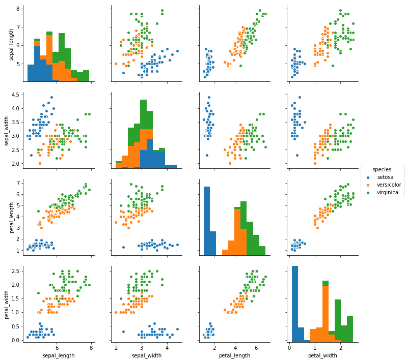
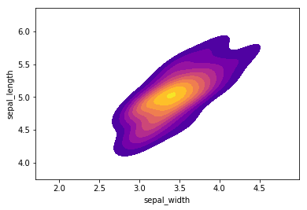

In [this project](https://github.com/mbastola/machine-learning-in-python/tree/master/SVM/iris-dataset) we utilize SVM to evaluate ML performanceson IRIS image dataset.
 

## The Data: [Iris flower data set](http://en.wikipedia.org/wiki/Iris_flower_data_set). 

The data set consists of 50 samples from each of three species of Iris (Iris setosa, Iris virginica and Iris versicolor), so 150 total samples. Four features were measured from each sample: the length and the width of the sepals and petals, in centimeters.

Here's a picture of the three different Iris types:

The dataset contains measurements for 150 iris flowers from three different species.

The three classes in the Iris dataset:

    Iris-setosa (n=50)
    Iris-versicolor (n=50)
    Iris-virginica (n=50)

The four features of the Iris dataset:

    sepal length in cm
    sepal width in cm
    petal length in cm
    petal width in cm

## Data Head

<table border="1" class="dataframe">
  <thead>
    <tr style="text-align: right;">
      <th></th>
      <th>sepal_length</th>
      <th>sepal_width</th>
      <th>petal_length</th>
      <th>petal_width</th>
      <th>species</th>
    </tr>
  </thead>
  <tbody>
    <tr>
      <th>0</th>
      <td>5.1</td>
      <td>3.5</td>
      <td>1.4</td>
      <td>0.2</td>
      <td>setosa</td>
    </tr>
    <tr>
      <th>1</th>
      <td>4.9</td>
      <td>3.0</td>
      <td>1.4</td>
      <td>0.2</td>
      <td>setosa</td>
    </tr>
    <tr>
      <th>2</th>
      <td>4.7</td>
      <td>3.2</td>
      <td>1.3</td>
      <td>0.2</td>
      <td>setosa</td>
    </tr>
    <tr>
      <th>3</th>
      <td>4.6</td>
      <td>3.1</td>
      <td>1.5</td>
      <td>0.2</td>
      <td>setosa</td>
    </tr>
    <tr>
      <th>4</th>
      <td>5.0</td>
      <td>3.6</td>
      <td>1.4</td>
      <td>0.2</td>
      <td>setosa</td>
    </tr>
  </tbody>
</table>

## Data Exploration

** Pairplot of the data set. Some flower species seems to be most separable.**

    <seaborn.axisgrid.PairGrid at 0x7fcf3d134cd0>

**Kde plot of sepal_length versus sepal width for setosa species of flower.**
    <matplotlib.axes._subplots.AxesSubplot at 0x7fcf17ad8990>

## Model Evaluation

**Confusion matrix and a classification report.**

    [[16  0  0]
     [ 0 21  1]
     [ 0  1 21]]

                 precision    recall  f1-score   support
    
         setosa       1.00      1.00      1.00        16
     versicolor       0.95      0.95      0.95        22
      virginica       0.95      0.95      0.95        22
    
    avg / total       0.97      0.97      0.97        60
    

The SVM model was pretty good here! For check, we tune the parameters to try to get even better using GridSearch.

    Fitting 3 folds for each of 16 candidates, totalling 48 fits
    [CV] C=0.1, gamma=1 ..................................................
    [CV] ......................................... C=0.1, gamma=1 -   0.0s
    [CV] C=0.1, gamma=1 ..................................................
    [CV] ......................................... C=0.1, gamma=1 -   0.0s
    [CV] C=0.1, gamma=1 ..................................................
    [CV] ......................................... C=0.1, gamma=1 -   0.0s
    [CV] C=0.1, gamma=0.1 ................................................
    [CV] ....................................... C=0.1, gamma=0.1 -   0.0s
    [CV] C=0.1, gamma=0.1 ................................................
    [CV] ....................................... C=0.1, gamma=0.1 -   0.0s
    [CV] C=0.1, gamma=0.1 ................................................
    [CV] ....................................... C=0.1, gamma=0.1 -   0.0s
    [CV] C=0.1, gamma=0.01 ...............................................
    [CV] ...................................... C=0.1, gamma=0.01 -   0.0s
    [CV] C=0.1, gamma=0.01 ...............................................
    [CV] ...................................... C=0.1, gamma=0.01 -   0.0s
    [CV] C=0.1, gamma=0.01 ...............................................
    [CV] ...................................... C=0.1, gamma=0.01 -   0.0s
    [CV] C=0.1, gamma=0.001 ..............................................
    [CV] ..................................... C=0.1, gamma=0.001 -   0.0s
    [CV] C=0.1, gamma=0.001 ..............................................
    [CV] ..................................... C=0.1, gamma=0.001 -   0.0s
    [CV] C=0.1, gamma=0.001 ..............................................
    [CV] ..................................... C=0.1, gamma=0.001 -   0.0s
    [CV] C=1, gamma=1 ....................................................
    [CV] ........................................... C=1, gamma=1 -   0.0s
    [CV] C=1, gamma=1 ....................................................
    [CV] ........................................... C=1, gamma=1 -   0.0s
    [CV] C=1, gamma=1 ....................................................
    [CV] ........................................... C=1, gamma=1 -   0.0s
    [CV] C=1, gamma=0.1 ..................................................
    [CV] ......................................... C=1, gamma=0.1 -   0.0s
    [CV] C=1, gamma=0.1 ..................................................
    [CV] ......................................... C=1, gamma=0.1 -   0.0s
    [CV] C=1, gamma=0.1 ..................................................
    [CV] ......................................... C=1, gamma=0.1 -   0.0s
    [CV] C=1, gamma=0.01 .................................................
    [CV] ........................................ C=1, gamma=0.01 -   0.0s
    [CV] C=1, gamma=0.01 .................................................
    [CV] ........................................ C=1, gamma=0.01 -   0.0s
    [CV] C=1, gamma=0.01 .................................................
    [CV] ........................................ C=1, gamma=0.01 -   0.0s
    [CV] C=1, gamma=0.001 ................................................
    [CV] ....................................... C=1, gamma=0.001 -   0.0s
    [CV] C=1, gamma=0.001 ................................................
    [CV] ....................................... C=1, gamma=0.001 -   0.0s
    [CV] C=1, gamma=0.001 ................................................
    [CV] ....................................... C=1, gamma=0.001 -   0.0s
    [CV] C=10, gamma=1 ...................................................
    [CV] .......................................... C=10, gamma=1 -   0.0s
    [CV] C=10, gamma=1 ...................................................
    [CV] .......................................... C=10, gamma=1 -   0.0s
    [CV] C=10, gamma=1 ...................................................
    [CV] .......................................... C=10, gamma=1 -   0.0s
    [CV] C=10, gamma=0.1 .................................................
    [CV] ........................................ C=10, gamma=0.1 -   0.0s
    [CV] C=10, gamma=0.1 .................................................
    [CV] ........................................ C=10, gamma=0.1 -   0.0s
    [CV] C=10, gamma=0.1 .................................................
    [CV] ........................................ C=10, gamma=0.1 -   0.0s
    [CV] C=10, gamma=0.01 ................................................
    [CV] ....................................... C=10, gamma=0.01 -   0.0s
    [CV] C=10, gamma=0.01 ................................................
    [CV] ....................................... C=10, gamma=0.01 -   0.0s
    [CV] C=10, gamma=0.01 ................................................
    [CV] ....................................... C=10, gamma=0.01 -   0.0s
    [CV] C=10, gamma=0.001 ...............................................
    [CV] ...................................... C=10, gamma=0.001 -   0.0s
    [CV] C=10, gamma=0.001 ...............................................
    [CV] ...................................... C=10, gamma=0.001 -   0.0s
    [CV] C=10, gamma=0.001 ...............................................
    [CV] ...................................... C=10, gamma=0.001 -   0.0s
    [CV] C=100, gamma=1 ..................................................
    [CV] ......................................... C=100, gamma=1 -   0.0s
    [CV] C=100, gamma=1 ..................................................
    [CV] ......................................... C=100, gamma=1 -   0.0s
    [CV] C=100, gamma=1 ..................................................
    [CV] ......................................... C=100, gamma=1 -   0.0s
    [CV] C=100, gamma=0.1 ................................................
    [CV] ....................................... C=100, gamma=0.1 -   0.0s
    [CV] C=100, gamma=0.1 ................................................
    [CV] ....................................... C=100, gamma=0.1 -   0.0s
    [CV] C=100, gamma=0.1 ................................................
    [CV] ....................................... C=100, gamma=0.1 -   0.0s
    [CV] C=100, gamma=0.01 ...............................................
    [CV] ...................................... C=100, gamma=0.01 -   0.0s
    [CV] C=100, gamma=0.01 ...............................................
    [CV] ...................................... C=100, gamma=0.01 -   0.0s
    [CV] C=100, gamma=0.01 ...............................................
    [CV] ...................................... C=100, gamma=0.01 -   0.0s
    [CV] C=100, gamma=0.001 ..............................................
    [CV] ..................................... C=100, gamma=0.001 -   0.0s
    [CV] C=100, gamma=0.001 ..............................................
    [CV] ..................................... C=100, gamma=0.001 -   0.0s
    [CV] C=100, gamma=0.001 ..............................................
    [CV] ..................................... C=100, gamma=0.001 -   0.0s

    [Parallel(n_jobs=1)]: Done   1 out of   1 | elapsed:    0.0s remaining:    0.0s
    [Parallel(n_jobs=1)]: Done  48 out of  48 | elapsed:    0.1s finished

** Classification reports and confusion matrices for best Grid Search params ?**

    [[19  0  0]
     [ 0 25  1]
     [ 0  0 15]]

                 precision    recall  f1-score   support
    
         setosa       1.00      1.00      1.00        19
     versicolor       1.00      0.96      0.98        26
      virginica       0.94      1.00      0.97        15
    
    avg / total       0.98      0.98      0.98        60
    

We notice only a small change, the SVM with default params did a good enough job.
